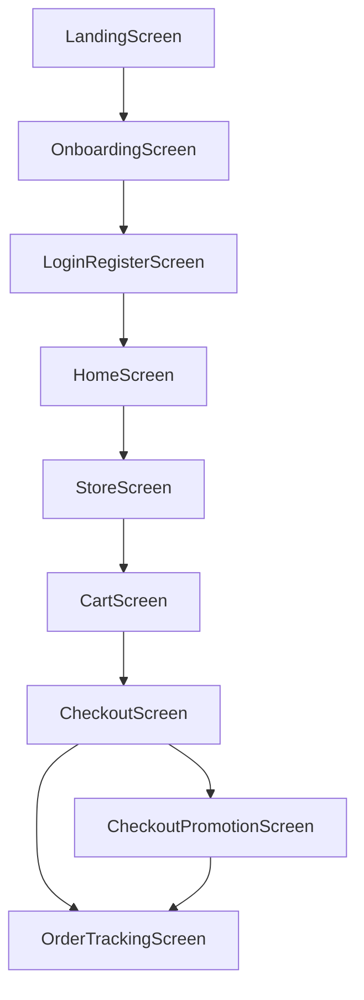
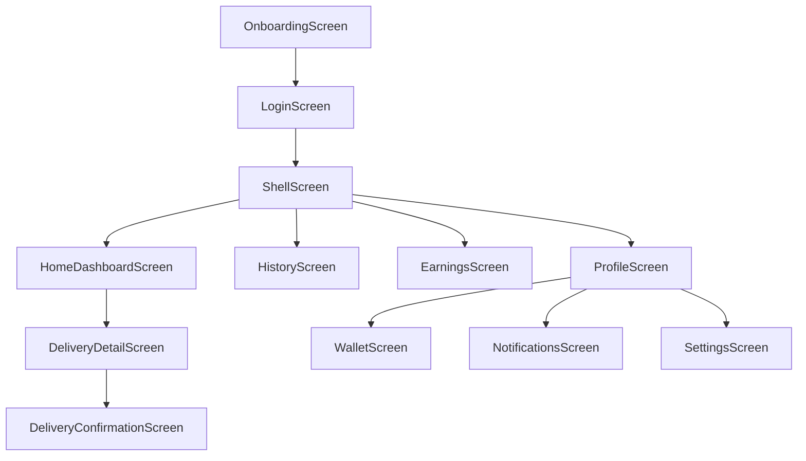

# Inventário de Ecrãs — Estado Actual das Três Aplicações

# Inventário de Ecrãs — Estado Actual das Três Aplicações

**Âmbito**: Análise estática de todos os ecrãs existentes. Nenhum código foi modificado.
**Data**: Maio 2026
**Aplicações cobertas**: App Cliente (`pede_aqui_delivery_app`), App Estafeta (`pede_aqui_courier_app`), Backoffice (`pede-aqui-backoffice`)

## Legenda de Fontes de Dados

| Símbolo | Significado |
| --- | --- |
| 🟢 API Real | Chamada HTTP real ao backend (mesmo que não esteja ligada) |
| 🟡 Mock | Dados fictícios em repositório mock com delay simulado |
| 🔴 Hardcoded | Valores literais no código do ecrã (strings, números) |
| ⚪ Local | Estado local apenas, sem dados externos |
| ❓ Desconhecido | Fonte não determinável sem execução |

## Legenda de Prioridade de Alinhamento

| Prioridade | Critério |
| --- | --- |
| **P1 — Crítico** | Bloqueia fluxo principal do utilizador ou tem dados completamente falsos visíveis |
| **P2 — Alto** | Funcionalidade importante com dados mock ou acções sem efeito real |
| **P3 — Médio** | Ecrã funcional mas com dados parcialmente hardcoded ou acções incompletas |
| **P4 — Baixo** | Ecrã estático por design ou com impacto mínimo no utilizador |

## Parte 1 — App Cliente (`pede_aqui_delivery_app`)

**Arquitectura**: Flutter BLoC/Cubit + GetIt + Dio
**Rota inicial**: `/onboarding`
**Localização**: `pt_MZ` configurada em `MaterialApp`
**DI**: `service_locator.dart` com flag `USE_MOCK_DATA=true` (padrão)
**Nota crítica**: `auth_repository.dart` é importado em `auth_cubit.dart` e `service_locator.dart` mas **o ficheiro não existe** — é uma dependência em falta que impede a compilação com `USE_MOCK_DATA=false`.



### DA-01 — LandingScreen

| Campo | Valor |
| --- | --- |
| **App** | pede_aqui_delivery_app |
| **Ficheiro** | file:pede_aqui_delivery_app/lib/features/catalog/presentation/landing_screen.dart |
| **Nome do ecrã** | `LandingScreen` |
| **Rota** | `/landing` |
| **Actor / Papel** | Visitante (não autenticado) |
| **Propósito** | Página de marketing/entrada da app — apresenta a proposta de valor e botões de download |

**Secções de UI**:

- Cabeçalho com logo e botão "Download App"
- Badge "NOVO NA SUA REGIÃO"
- Título e subtítulo de marketing
- Botões App Store e Google Play
- Imagem placeholder (container cinzento com texto "img")
- Card flutuante com "Prato do Dia — Moqueca Baiana" (hardcoded)
- Botão "Explorar restaurantes"

**Dados exibidos**:

- "Moqueca Baiana" — 🔴 Hardcoded
- "NOVO NA SUA REGIÃO" — 🔴 Hardcoded
- Imagem do prato — 🔴 Placeholder (sem imagem real)

**Acções do utilizador**:

- "Download App" → navega para `/onboarding`
- "App Store" → `onTap: () {}` (sem acção)
- "Google Play" → `onTap: () {}` (sem acção)
- "Explorar restaurantes" → navega para `/home` (salta autenticação)

**Workflow relacionado**: Entrada na app / Marketing
**Caso de uso**: Apresentação do produto a novos utilizadores
**Informação em falta**: Imagem real do prato do dia; links reais para App Store e Google Play
**Prioridade**: **P4** — Ecrã estático por design; os links de loja são os únicos itens a corrigir

### DA-02 — OnboardingScreen

| Campo | Valor |
| --- | --- |
| **App** | pede_aqui_delivery_app |
| **Ficheiro** | file:pede_aqui_delivery_app/lib/features/catalog/presentation/onboarding_screen.dart |
| **Nome do ecrã** | `OnboardingScreen` |
| **Rota** | `/onboarding` (rota inicial da app) |
| **Actor / Papel** | Visitante (não autenticado) |
| **Propósito** | Ecrã de boas-vindas de passo único com ilustração e CTA para autenticação |

**Secções de UI**:

- Logo centrado
- Ilustração com gradiente e ícones flutuantes (restaurante, café, fast food)
- Título "Descubra perto de si"
- Subtítulo descritivo
- Indicadores de paginação (3 pontos — apenas 1 activo, os outros 2 não têm conteúdo)
- Botão "Continuar" → `/auth`
- Link "Já tenho conta" → `/auth`

**Dados exibidos**: Todos estáticos — ⚪ Local
**Acções do utilizador**:

- "Continuar" → `pushReplacementNamed(AppRoutes.auth)`
- "Já tenho conta" → `pushReplacementNamed(AppRoutes.auth)`

**Informação em falta**: Os 3 pontos de paginação sugerem múltiplos passos de onboarding, mas apenas 1 ecrã existe. Os passos 2 e 3 estão em falta.
**Prioridade**: **P4** — Estático por design; apenas os passos de onboarding em falta são relevantes

### DA-03 — LoginRegisterScreen

| Campo | Valor |
| --- | --- |
| **App** | pede_aqui_delivery_app |
| **Ficheiro** | file:pede_aqui_delivery_app/lib/features/auth/presentation/login_register_screen.dart |
| **Nome do ecrã** | `LoginRegisterScreen` |
| **Rota** | `/auth` |
| **Actor / Papel** | Visitante (não autenticado) → `CUSTOMER` |
| **Propósito** | Autenticação e registo de clientes — tabs "Entrar" / "Registar" |

**Secções de UI**:

- Logo
- Container com tabs "Entrar" / "Registar"
- Campo Nome (apenas no registo)
- Campo Email
- Campo Palavra-passe
- Link "Esqueceu a palavra-passe?" (sem acção)
- Botão principal "ENTRAR" / "CRIAR CONTA"
- Divisor "ou continue com"
- Botão "Continuar com Google"
- Texto de termos e política de privacidade

**Dados exibidos**:

- Email pré-preenchido: `felix@pedeaqui.co.mz` — 🔴 Hardcoded
- Palavra-passe pré-preenchida: `123456` — 🔴 Hardcoded
- Nome pré-preenchido: `Felix` — 🔴 Hardcoded

**Acções do utilizador**:

- Tab "Entrar" / "Registar" → alterna estado local
- "ENTRAR" → `AuthCubit.login(email, password)` → `MockAuthRepository` (🟡 Mock)
- "CRIAR CONTA" → `AuthCubit.register(name, email, password)` → `MockAuthRepository` (🟡 Mock)
- "Continuar com Google" → `pushNamedAndRemoveUntil(AppRoutes.home)` — 🔴 Salta autenticação completamente
- "Esqueceu a palavra-passe?" → `onPressed: () {}` — sem acção

**Estado de gestão**: `AuthCubit` com `AuthState { loading, user, error }`
**Fonte de dados**: 🟡 Mock — `MockAuthRepository` (ficheiro `auth_repository.dart` **não existe** — dependência em falta)
**Workflow relacionado**: Autenticação de cliente
**Caso de uso**: Login com email/palavra-passe; registo de nova conta
**Informação em falta**:

- `auth_repository.dart` não existe (ficheiro referenciado mas ausente)
- Sem validação de formulário (email, comprimento de palavra-passe)
- Sem tratamento de erro visível ao utilizador (o `state.error` existe mas não é renderizado no ecrã)
- Sem refresh token / persistência de sessão
- Google OAuth não implementado
- "Esqueceu a palavra-passe?" sem implementação
- Endpoint de registo não existe no backend

**Prioridade**: **P1 — Crítico** — Bloqueia todo o fluxo autenticado; credenciais hardcoded; ficheiro de repositório em falta

### DA-04 — HomeScreen

| Campo | Valor |
| --- | --- |
| **App** | pede_aqui_delivery_app |
| **Ficheiro** | file:pede_aqui_delivery_app/lib/features/catalog/presentation/home_screen.dart |
| **Nome do ecrã** | `HomeScreen` |
| **Rota** | `/home` |
| **Actor / Papel** | `CUSTOMER` (autenticado) |
| **Propósito** | Ecrã principal de descoberta — mostra categorias, vendedores abertos e populares |

**Secções de UI**:

- Barra superior: localização, ícone de notificações, ícone de carrinho com badge
- Saudação "Bom dia, Felix!"
- Barra de pesquisa com botão "Buscar"
- Carrossel horizontal de categorias (ícone + nome)
- Secção "Abertos Agora" — 2 `VendorCard` horizontais
- Secção "Populares perto de si" — lista vertical de `VendorCard`
- Banner "Farmácias 24h" (hardcoded)

**Dados exibidos**:

- Nome "Felix" — 🔴 Hardcoded (não vem do `AuthState`)
- Localização "Av. Julius Nyerere" — 🔴 Hardcoded
- Categorias — 🟡 Mock (`MockCatalogRepository._categories`: Restaurantes, Super, Farmácias, Conveniência, Tecnologia)
- Vendedores — 🟡 Mock (`MockCatalogRepository._vendors`: Avenida Gourmet, Burger House, Green Garden Bowl, Sushi Zen Master)
- Badge do carrinho — ⚪ Local (sempre visível, não reflecte estado real)

**Acções do utilizador**:

- Ícone de notificações → `onPressed: () {}` — sem acção
- Ícone de carrinho → navega para `/cart`
- Botão "Buscar" → `onPressed: () {}` — sem acção (pesquisa não funcional)
- Categoria → sem acção (não navegável)
- `VendorCard` → navega para `/store` (implícito via widget)
- "Ver todos" → sem acção

**Estado de gestão**: `CatalogCubit` com `CatalogState { loading, categories, vendors, products, selectedVendor, error }`
**Carregamento**: `CatalogCubit.loadHome()` chamado em `initState` (via `BlocBuilder`)
**Fonte de dados**: 🟡 Mock — `MockCatalogRepository`; `ApiCatalogRepository` existe mas não está activo
**Workflow relacionado**: Descoberta de vendedores
**Caso de uso**: Cliente pesquisa e navega por vendedores disponíveis na sua área
**Informação em falta**:

- Nome do utilizador não vem do `AuthState` (hardcoded "Felix")
- Pesquisa não funcional
- Categorias não vêm de API (não existe endpoint de categorias no backend)
- Localização não é real (GPS não implementado)
- Badge do carrinho não reflecte itens reais
- Sem estado de erro visível
- Sem estado vazio ("Nenhum vendedor disponível")

**Prioridade**: **P1 — Crítico** — Ecrã principal com todos os dados mock

### DA-05 — StoreScreen

| Campo | Valor |
| --- | --- |
| **App** | pede_aqui_delivery_app |
| **Ficheiro** | file:pede_aqui_delivery_app/lib/features/catalog/presentation/store_screen.dart |
| **Nome do ecrã** | `StoreScreen` |
| **Rota** | `/store` |
| **Actor / Papel** | `CUSTOMER` (autenticado) |
| **Propósito** | Catálogo de produtos de um vendedor específico — permite adicionar ao carrinho |

**Secções de UI**:

- AppBar com botão voltar, pesquisa e notificações
- Banner do vendedor com gradiente, emoji e card de informação
- Nome do vendedor, tempo estimado ("17 min"), descrição, avaliação (4.8), taxa de entrega ("150 MT")
- Tabs de categorias de menu (Entradas, Pratos Principais, Bebidas, Sobremesas) — apenas visual, sem filtragem
- Título de secção "Entradas"
- Grid 2 colunas de `ProductTile`
- Banner inferior "3 itens no carrinho" com botão "Ver carrinho"

**Dados exibidos**:

- Vendedor carregado via `CatalogCubit.loadStore('avenida-gourmet')` — ID hardcoded no `initState`
- Nome do vendedor: `vendor?.name ?? 'Avenida Gourmet'` — fallback hardcoded
- Tempo "17 min" — 🔴 Hardcoded (não vem do modelo)
- Avaliação "4.8" — 🔴 Hardcoded
- Taxa "150 MT" — 🔴 Hardcoded
- Produtos — 🟡 Mock (5 produtos do `MockCatalogRepository`)
- "3 itens no carrinho" — 🔴 Hardcoded

**Acções do utilizador**:

- Voltar → `Navigator.maybePop`
- Pesquisa → `onPressed: () {}` — sem acção
- Notificações → `onPressed: () {}` — sem acção
- Tabs de menu → apenas visual, sem filtragem real
- `ProductTile` botão "Adicionar" → navega para `/cart` (não adiciona ao carrinho via API)
- "Ver carrinho" → navega para `/cart`

**Estado de gestão**: `CatalogCubit` (partilhado com `HomeScreen`)
**Fonte de dados**: 🟡 Mock — `MockCatalogRepository`; `ApiCatalogRepository.getProductsByVendor()` existe
**Workflow relacionado**: Navegação no catálogo de um vendedor
**Caso de uso**: Cliente visualiza produtos e adiciona ao carrinho
**Informação em falta**:

- `vendorId` hardcoded como `'avenida-gourmet'` — deve vir da navegação
- Avaliação, tempo e taxa hardcoded no ecrã (não vêm do modelo `Vendor`)
- Botão "Adicionar" não chama `CartCubit` — apenas navega
- Tabs de categorias não filtram produtos
- Pesquisa não funcional
- Sem estado de carregamento de produtos
- Sem estado vazio ("Sem produtos disponíveis")

**Prioridade**: **P1 — Crítico** — Adicionar ao carrinho não funciona; vendorId hardcoded

### DA-06 — CartScreen

| Campo | Valor |
| --- | --- |
| **App** | pede_aqui_delivery_app |
| **Ficheiro** | file:pede_aqui_delivery_app/lib/features/cart/presentation/cart_screen.dart |
| **Nome do ecrã** | `CartScreen` |
| **Rota** | `/cart` |
| **Actor / Papel** | `CUSTOMER` (autenticado) |
| **Propósito** | Visualização e gestão do carrinho de compras antes do checkout |

**Secções de UI**:

- Cabeçalho "Carrinho — Avenida Gourmet" (hardcoded)
- Card de morada de entrega: "Av. Julius Nyerere, 123, Polana" (hardcoded)
- Botão de editar morada (sem acção)
- Título "Os teus itens"
- Lista de `_CartItemTile` com botões +/- de quantidade
- `OrderSummaryCard` com subtotal, taxa, impostos, total
- Botão "Confirmar encomenda" → `/checkout`

**Dados exibidos**:

- Título "Avenida Gourmet" — 🔴 Hardcoded
- Morada "Av. Julius Nyerere, 123, Polana" — 🔴 Hardcoded
- Itens do carrinho — 🟡 Mock (`MockCartRepository`: Chamuças de Carne 2x120MT, Asas Peri-Peri 1x450MT)
- Subtotal calculado localmente a partir dos itens mock
- Taxa de entrega: 150 MT — 🟡 Mock
- Impostos: 103,50 MT — 🟡 Mock

**Acções do utilizador**:

- Botão editar morada → `onPressed: () {}` — sem acção
- Botão notificações → `onPressed: () {}` — sem acção
- Botão `-` → `CartCubit.updateQuantity(productId, quantity - 1)` → `MockCartRepository.updateQuantity()` (🟡 Mock)
- Botão `+` → `CartCubit.updateQuantity(productId, quantity + 1)` → `MockCartRepository.updateQuantity()` (🟡 Mock)
- "Confirmar encomenda" → navega para `/checkout`

**Estado de gestão**: `CartCubit` com `CartState { loading, summary, error }`
**Carregamento**: `CartCubit.loadCart()` chamado em `initState`
**Fonte de dados**: 🟡 Mock — `MockCartRepository`; `ApiCartRepository` existe mas incompleto (não retorna itens, apenas preços)
**Workflow relacionado**: Gestão do carrinho
**Caso de uso**: Cliente revê itens, ajusta quantidades e avança para checkout
**Informação em falta**:

- Morada de entrega hardcoded (sem integração com perfil do utilizador)
- Nome do vendedor hardcoded
- `ApiCartRepository.getCart()` retorna `CartSummary` com `items: []` — itens não são carregados da API
- Sem acção de remover item (apenas `updateQuantity`)
- Sem aviso de carrinho vazio com CTA para explorar
- Formatação de moeda: usa `MoneyText` — verificar se usa `pt_MZ`

**Prioridade**: **P1 — Crítico** — Dados mock; API de carrinho incompleta

### DA-07 — CheckoutScreen

| Campo | Valor |
| --- | --- |
| **App** | pede_aqui_delivery_app |
| **Ficheiro** | file:pede_aqui_delivery_app/lib/features/checkout/presentation/checkout_screen.dart |
| **Nome do ecrã** | `CheckoutScreen` |
| **Rota** | `/checkout` |
| **Actor / Papel** | `CUSTOMER` (autenticado) |
| **Propósito** | Confirmação final da encomenda — resumo, método de pagamento, código promocional |

**Secções de UI**:

- Banner "Receita Validada" (hardcoded — contexto de farmácia)
- Card de resumo do pedido com botão "Editar"
- Linhas de itens: Amoxicilina 500mg (450 MT), Vitamina C + Zinco (320 MT) — hardcoded
- Linhas de totais: Subtotal, Taxa de Entrega, Total
- Secção "Método de Pagamento" com opções M-Pesa e Dinheiro (apenas visual)
- Campo de código promocional com botão "Aplicar"
- Botão "Fazer encomenda"
- Texto de termos

**Dados exibidos**:

- Itens: Amoxicilina 500mg, Vitamina C + Zinco — 🔴 Hardcoded (não vêm do carrinho)
- Subtotal: `summary?.subtotal ?? 1090` — fallback hardcoded 1090
- Taxa de entrega: `summary?.deliveryFee ?? 120` — fallback hardcoded 120
- Total: `summary?.total ?? 1210` — fallback hardcoded 1210
- Localização "Polana / Maputo" — 🔴 Hardcoded no AppBar
- Banner "Receita Validada" — 🔴 Hardcoded (não contextual)

**Acções do utilizador**:

- "Editar" → navega para `/cart`
- Selecção de método de pagamento → apenas visual (sem estado)
- "Aplicar" código promocional → navega para `/checkout-promo` (não valida código)
- "Fazer encomenda" → navega para `/order-tracking` (sem criar encomenda na API)

**Estado de gestão**: Lê `CartCubit.state.summary` via `context.watch` — sem cubit próprio
**Fonte de dados**: 🔴 Hardcoded — itens fixos no código; totais com fallback hardcoded
**Workflow relacionado**: Checkout e criação de encomenda
**Caso de uso**: Cliente confirma encomenda, escolhe pagamento e submete
**Informação em falta**:

- Itens completamente hardcoded (não vêm do carrinho)
- Nenhuma chamada à API de checkout (`POST /api/v1/checkout`)
- Nenhuma chamada à API de pagamento (`POST /api/v1/payments/{id}/confirm`)
- Método de pagamento não tem estado (não é possível seleccionar)
- Código promocional não é validado
- Banner "Receita Validada" não é contextual
- Sem idempotency key
- Sem tratamento de erro de checkout

**Prioridade**: **P1 — Crítico** — Nenhuma encomenda é criada; dados completamente hardcoded

### DA-08 — CheckoutPromotionScreen

| Campo | Valor |
| --- | --- |
| **App** | pede_aqui_delivery_app |
| **Ficheiro** | file:pede_aqui_delivery_app/lib/features/checkout/presentation/checkout_promotion_screen.dart |
| **Nome do ecrã** | `CheckoutPromotionScreen` |
| **Rota** | `/checkout-promo` |
| **Actor / Papel** | `CUSTOMER` (autenticado) |
| **Propósito** | Variante do checkout com promoção aplicada — mostra desconto e entrega gratuita |

**Secções de UI**:

- Banner verde "PROMOTION APPLIED — WEEKENDJOLLOF"
- Secção "ENTREGA EM" com morada hardcoded
- Secção "SEU PEDIDO" com itens
- Secção "PAGAMENTO" com cartão "•••• 4242"
- Resumo com subtotal, entrega gratuita, desconto, total
- Campo de código promocional aplicado com botão "Remove"
- Botão "Place Order"

**Dados exibidos**:

- Código "WEEKENDJOLLOF" — 🔴 Hardcoded
- Itens: "Smokey Jollof Feast" (4400), "Grilled Beef Suya" (2900) — 🔴 Hardcoded (nomes em inglês, contexto nigeriano)
- Morada: "14 Commercial Ave, Ikoyi Suite, Lagos" — 🔴 Hardcoded (Lagos, Nigéria — contexto errado para Moçambique)
- Cartão "•••• 4242" — 🔴 Hardcoded
- Desconto: 1500 — 🔴 Hardcoded
- Entrega: "FREE" — 🔴 Hardcoded
- Labels em inglês: "PROMOTION APPLIED", "SEU PEDIDO" (misto PT/EN), "Place Order" — 🔴 Localização incorrecta

**Acções do utilizador**:

- "Change" (morada) → `onPressed: () {}` — sem acção
- "Remove" (código) → `onPressed: () {}` — sem acção
- "Place Order" → navega para `/order-tracking` (sem criar encomenda)

**Fonte de dados**: 🔴 Completamente hardcoded — `const CartSummary(...)` definido no `build()`
**Workflow relacionado**: Checkout com promoção
**Caso de uso**: Cliente aplica código promocional e confirma encomenda com desconto
**Informação em falta**:

- Ecrã completamente hardcoded com dados de contexto errado (Lagos, Nigéria)
- Labels em inglês (ecrã deve ser em PT)
- Sem integração com API de promoções (não existe no backend MVP)
- Sem integração com checkout API
- Dados de itens não correspondem ao carrinho real

**Prioridade**: **P1 — Crítico** — Dados de contexto errado (Lagos); labels em inglês; sem funcionalidade real

### DA-09 — OrderTrackingScreen

| Campo | Valor |
| --- | --- |
| **App** | pede_aqui_delivery_app |
| **Ficheiro** | file:pede_aqui_delivery_app/lib/features/orders/presentation/order_tracking_screen.dart |
| **Nome do ecrã** | `OrderTrackingScreen` |
| **Rota** | `/order-tracking` |
| **Actor / Papel** | `CUSTOMER` (autenticado) |
| **Propósito** | Rastreamento em tempo real da encomenda — estado, código de entrega, estafeta, detalhes |

**Secções de UI**:

- AppBar com referência da encomenda
- Mapa simulado (gradiente com pontos coloridos e linha)
- Pill "Chegada em aprox. X min"
- Timeline de estados (5 passos)
- Secção "Código de Entrega" com 6 caixas de dígitos
- Card do estafeta com nome, avaliação e botão de chamada
- Card "Detalhes do Pedido" com itens e totais

**Dados exibidos**:

- Referência no AppBar: "Encomenda #PA-2026-00891" — 🔴 Hardcoded
- Tempo estimado: `order.estimatedMinutes` — 🟡 Mock (25 min)
- Código de entrega: `['4', '7', '2', '9', '8', '1']` — 🔴 Hardcoded no `build()` (não vem do modelo)
- Nome do estafeta: `order.courierName` — 🟡 Mock ("Kiala Miguel")
- Avaliação "4.9 • 214 entregas" — 🔴 Hardcoded
- Itens: Muamba Tradicional (14500 MT), Sumo de Maçã (2500 MT) — 🟡 Mock
- Subtotal: 16500 MT, Taxa: 500 MT, Total: 17000 MT — 🟡 Mock

**Acções do utilizador**:

- Voltar → `Navigator.pop`
- Notificações → `onPressed: () {}` — sem acção
- Botão de chamada ao estafeta → `onPressed: () {}` — sem acção

**Estado de gestão**: `OrderTrackingCubit` com `OrderTrackingState { loading, order, error }`
**Carregamento**: `OrderTrackingCubit.loadActiveOrder()` em `initState`
**Fonte de dados**: 🟡 Mock — `MockOrderRepository`; `ApiOrderRepository` existe mas usa `orderId` hardcoded `/orders/ord_001/tracking`
**Workflow relacionado**: Rastreamento de encomenda
**Caso de uso**: Cliente acompanha o estado da sua encomenda em tempo real
**Informação em falta**:

- `orderId` hardcoded em `ApiOrderRepository` (`ord_001`)
- Código de entrega hardcoded no `build()` (não vem do `order` model — o modelo não tem campo `deliveryCode`)
- Sem polling automático (sem `Timer` ou `Stream`)
- Avaliação e contagem de entregas do estafeta hardcoded
- Botão de chamada sem acção
- Sem estado para encomenda entregue ou cancelada
- `DeliveryOrder` não tem campo `deliveryCode` — modelo incompleto

**Prioridade**: **P1 — Crítico** — Código de entrega hardcoded; sem polling; orderId fixo

## Parte 2 — App Estafeta (`pede_aqui_courier_app`)

**Arquitectura**: Flutter BLoC/Cubit + Provider + Dio
**Rota inicial**: `/app` (ShellScreen) — **sem autenticação na rota inicial**
**Localização**: `pt_MZ` configurada em `MaterialApp`
**DI**: Sem `InjectionContainer` — cubits instanciados directamente via `MultiBlocProvider` (presumivelmente em `main.dart`)
**Repositório**: `CourierRepositoryImpl` com `CourierDataSource` (abstracto); `MockCourierDataSource` e `RemoteCourierDataSource` existem
**Nota**: A app estafeta tem uma arquitectura de repositório mais completa que a app cliente — `RemoteCourierDataSource` já tem implementações reais para a maioria dos endpoints



### CA-01 — OnboardingScreen

| Campo | Valor |
| --- | --- |
| **App** | pede_aqui_courier_app |
| **Ficheiro** | file:pede_aqui_courier_app/lib/presentation/screens/onboarding_screen.dart |
| **Nome do ecrã** | `OnboardingScreen` |
| **Rota** | `/onboarding` |
| **Actor / Papel** | Estafeta (não autenticado) |
| **Propósito** | Ecrã de boas-vindas para estafetas — apresenta a proposta de valor |

**Secções de UI**:

- Ilustração com gradiente e ícone de entrega
- Título "Entregas rápidas, ganhos claros."
- Subtítulo com referência a Maputo e código seguro
- Botão "Começar" → `/login`

**Dados exibidos**: Todos estáticos — ⚪ Local
**Acções do utilizador**: "Começar" → `pushReplacementNamed(AppRoutes.login)`
**Informação em falta**: Nenhuma — ecrã estático por design
**Prioridade**: **P4** — Estático por design

### CA-02 — LoginScreen

| Campo | Valor |
| --- | --- |
| **App** | pede_aqui_courier_app |
| **Ficheiro** | file:pede_aqui_courier_app/lib/presentation/screens/login_screen.dart |
| **Nome do ecrã** | `LoginScreen` |
| **Rota** | `/login` |
| **Actor / Papel** | Estafeta (não autenticado) → `COURIER` |
| **Propósito** | Autenticação do estafeta por telefone e palavra-passe |

**Secções de UI**:

- Ícone de entrega e título "Pede Aqui Estafeta"
- Subtítulo com referência a Maputo
- Campo Telefone com hint `+258 84 123 4567`
- Campo Palavra-passe
- Botão "Entrar"
- Link "Criar conta de estafeta"

**Dados exibidos**: Sem dados pré-preenchidos — ⚪ Local
**Acções do utilizador**:

- "Entrar" → `pushReplacementNamed(AppRoutes.shell)` — 🔴 Navega directamente sem autenticação
- "Criar conta de estafeta" → `onPressed: () {}` — sem acção

**Estado de gestão**: Nenhum — sem `AuthCubit` ou repositório de auth
**Fonte de dados**: ⚪ Local — sem chamada a qualquer API
**Workflow relacionado**: Autenticação de estafeta
**Caso de uso**: Estafeta autentica-se para aceder ao dashboard
**Informação em falta**:

- Sem `AuthCubit` para a app estafeta
- Sem validação de formato de telefone
- Sem chamada à API de autenticação (Keycloak)
- Sem verificação de papel `COURIER`
- Sem persistência de token
- "Criar conta" sem implementação

**Prioridade**: **P1 — Crítico** — Sem autenticação real; navega directamente para o shell

### CA-03 — ShellScreen

| Campo | Valor |
| --- | --- |
| **App** | pede_aqui_courier_app |
| **Ficheiro** | file:pede_aqui_courier_app/lib/presentation/screens/shell_screen.dart |
| **Nome do ecrã** | `ShellScreen` |
| **Rota** | `/app` (rota inicial da app) |
| **Actor / Papel** | `COURIER` (autenticado) |
| **Propósito** | Container de navegação por tabs — aloja os 4 ecrãs principais |

**Secções de UI**:

- `IndexedStack` com 4 ecrãs: `HomeDashboardScreen`, `HistoryScreen`, `EarningsScreen`, `ProfileScreen`
- `PedeAquiBottomNavigation` com 4 tabs

**Dados exibidos**: Nenhum directamente — delega para os ecrãs filhos
**Acções do utilizador**: Navegação entre tabs
**Informação em falta**: Sem guarda de autenticação — qualquer utilizador acede directamente
**Prioridade**: **P2** — Precisa de guarda de autenticação

### CA-04 — HomeDashboardScreen

| Campo | Valor |
| --- | --- |
| **App** | pede_aqui_courier_app |
| **Ficheiro** | file:pede_aqui_courier_app/lib/presentation/screens/home_dashboard_screen.dart |
| **Nome do ecrã** | `HomeDashboardScreen` |
| **Rota** | `/app` (tab 0) |
| **Actor / Papel** | `COURIER` (autenticado) |
| **Propósito** | Dashboard principal do estafeta — disponibilidade, entrega activa, jobs disponíveis, ganhos do dia |

**Secções de UI**:

- AppBar com saudação e avatar (nome do `ProfileCubit`)
- `RefreshIndicator` para pull-to-refresh
- `AvailabilityCard` com toggle de disponibilidade
- `EarningsPill` com ganhos do dia
- Secção "Entrega activa" com `ActiveDeliveryCard`
- Indicador "EM CURSO"
- Secção "Entregas disponíveis" com lista de `AvailableJobCard`
- `WeeklyChartCard` com gráfico semanal

**Dados exibidos**:

- Nome do estafeta: `profileState.profile?.name.split(' ').first ?? 'Félix'` — fallback hardcoded "Félix"
- Disponibilidade: `state.isAvailable` — 🟡 Mock (inicial: `true`)
- Entrega activa: `state.activeDelivery` — 🟡 Mock (delivery-00891, João Silva, Bella Pizza Polana)
- Jobs disponíveis: `state.availableJobs` — 🟡 Mock (3 jobs: Burger House, KFC, Farmácia Avenida)
- Ganhos do dia: `earningsState.summary?.today ?? 1250` — fallback hardcoded 1250

**Acções do utilizador**:

- Pull-to-refresh → `DashboardCubit.loadDashboard()` + `EarningsCubit.loadEarnings()`
- Toggle disponibilidade → `DashboardCubit.toggleAvailability(value)` → `MockCourierDataSource.updateAvailability()` (🟡 Mock)
- "Aceitar" job → `DashboardCubit.acceptJob(jobId)` → `MockCourierDataSource.acceptJob()` (🟡 Mock)
- "Rejeitar" job → `DashboardCubit.rejectJob(jobId)` → `MockCourierDataSource.rejectJob()` (🟡 Mock)

**Estado de gestão**: `DashboardCubit`, `EarningsCubit`, `ProfileCubit`
**Fonte de dados**: 🟡 Mock — `MockCourierDataSource`; `RemoteCourierDataSource` existe com implementações reais
**Workflow relacionado**: Gestão de disponibilidade e aceitação de jobs
**Caso de uso**: Estafeta gere a sua disponibilidade e aceita/rejeita entregas
**Informação em falta**:

- Fallback "Félix" hardcoded
- Fallback de ganhos "1250" hardcoded
- Sem polling automático de jobs disponíveis
- Rejeitar job não pede motivo (obrigatório na API)
- `RemoteCourierDataSource.getAvailableJobs()` filtra por `status == 'DISPATCH_PENDING'` mas a API retorna todos os jobs

**Prioridade**: **P1 — Crítico** — Ecrã principal com todos os dados mock

### CA-05 — DeliveryDetailScreen

| Campo | Valor |
| --- | --- |
| **App** | pede_aqui_courier_app |
| **Ficheiro** | file:pede_aqui_courier_app/lib/presentation/screens/delivery_detail_screen.dart |
| **Nome do ecrã** | `DeliveryDetailScreen` |
| **Rota** | `/delivery-detail` |
| **Actor / Papel** | `COURIER` (autenticado) |
| **Propósito** | Detalhes completos de uma entrega activa — endereços, estado, itens, acções de progressão |

**Secções de UI**:

- AppBar com título "Detalhes da Entrega" e referência
- `DeliveryStatusStepper` com estado actual
- `MapPreview` com tempo estimado
- `AddressCard` do vendedor (recolha)
- `AddressCard` do cliente (destino)
- Chips de itens, método de pagamento, distância
- Botão "Cheguei ao cliente" (fixo no fundo)

**Dados exibidos**:

- Referência: `delivery.reference` — 🟡 Mock ("#PA-2026-00891")
- Vendedor: `delivery.vendor` — 🟡 Mock (Bella Pizza Polana, Av. Julius Nyerere, 124)
- Destino: `delivery.destination` — 🟡 Mock (João Silva, Av. Eduardo Mondlane, 456)
- Estado: `delivery.status` — 🟡 Mock (`DeliveryStatus.goingToClient`)
- Tempo estimado: `delivery.estimatedMinutes` — 🟡 Mock (12 min)
- Itens: `delivery.items` — 🟡 Mock (Pizza Familiar x2, Coca-Cola x1)
- Método: `delivery.paymentMethod` — 🟡 Mock ("Pagar no destino")
- Distância: `delivery.distanceKm` — 🟡 Mock (4.2 km)

**Acções do utilizador**:

- Botão "..." (mais opções) → `onPressed: () {}` — sem acção
- "Cheguei ao cliente" → navega para `/confirm-delivery`

**Estado de gestão**: `DeliveryCubit` com `DeliveryState { isLoading, delivery, otpCode, hasProofPhoto, isConfirmed }`
**Fonte de dados**: 🟡 Mock — `MockCourierDataSource.getActiveDelivery()`
**Workflow relacionado**: Progressão do ciclo de vida da entrega
**Caso de uso**: Estafeta actualiza o estado da entrega (chegou ao vendedor, recolheu, a caminho, chegou ao cliente)
**Informação em falta**:

- Apenas o botão "Cheguei ao cliente" existe — faltam botões para estados anteriores (ARRIVED_AT_VENDOR, PICKED_UP, ON_ROUTE_TO_CUSTOMER)
- `DeliveryCubit.arrivedAtCustomer()` apenas actualiza estado local, não chama API
- `PATCH /api/v1/deliveries/{id}/status` não é chamado em nenhum ponto
- Sem polling de actualização do estado

**Prioridade**: **P1 — Crítico** — Progressão de estados não chama API; estados intermédios em falta

### CA-06 — DeliveryConfirmationScreen

| Campo | Valor |
| --- | --- |
| **App** | pede_aqui_courier_app |
| **Ficheiro** | file:pede_aqui_courier_app/lib/presentation/screens/delivery_confirmation_screen.dart |
| **Nome do ecrã** | `DeliveryConfirmationScreen` |
| **Rota** | `/confirm-delivery` |
| **Actor / Papel** | `COURIER` (autenticado) |
| **Propósito** | Confirmação final da entrega — input do código de 6 dígitos do cliente e foto de prova |

**Secções de UI**:

- AppBar "Confirmar entrega"
- Card com referência e nome do cliente
- Card "Código de Verificação" com instrução
- Input OTP de 6 dígitos (visual + campo de texto)
- Botão "Tirar foto de prova" / "Foto de prova anexada"
- Botão "Confirmar entrega" (desactivado até código completo + foto)
- Banner decorativo com morada hardcoded

**Dados exibidos**:

- Referência: `delivery.reference` — 🟡 Mock
- Nome do cliente: `delivery.customerName` — 🟡 Mock ("João Silva")
- Morada no banner: "Av. Eduardo Mondlane, 456 • Maputo" — 🔴 Hardcoded
- Código OTP: estado local `state.otpCode`

**Acções do utilizador**:

- Input OTP → `DeliveryCubit.updateOtp(value)` — ⚪ Local
- "Tirar foto de prova" → `DeliveryCubit.toggleProofPhoto()` — ⚪ Local (sem upload real)
- "Confirmar entrega" → `DeliveryCubit.confirmDelivery()` → `MockCourierDataSource.confirmDelivery()` (🟡 Mock)

**Condição de activação do botão**: `state.canConfirm = otpCode.length == 6 && hasProofPhoto` — **foto obrigatória** (pode ser um bloqueio para o utilizador)
**Fonte de dados**: 🟡 Mock — `MockCourierDataSource.confirmDelivery()` (delay simulado, sem validação de código)
**Nota**: `RemoteCourierDataSource.confirmDelivery()` existe e chama `POST /api/v1/deliveries/{id}/complete` correctamente
**Workflow relacionado**: Confirmação de entrega com código seguro
**Caso de uso**: Estafeta pede código ao cliente e confirma entrega
**Informação em falta**:

- Foto de prova obrigatória (`canConfirm` requer `hasProofPhoto`) mas upload não está implementado
- Morada no banner hardcoded
- Sem tratamento de erro de código inválido (API retorna erro mas mock não valida)
- Sem opção "Entrega falhada" com motivo

**Prioridade**: **P1 — Crítico** — Confirmação não chama API real; foto obrigatória sem upload implementado

### CA-07 — EarningsScreen

| Campo | Valor |
| --- | --- |
| **App** | pede_aqui_courier_app |
| **Ficheiro** | file:pede_aqui_courier_app/lib/presentation/screens/earnings_screen.dart |
| **Nome do ecrã** | `EarningsScreen` |
| **Rota** | `/app` (tab 2) |
| **Actor / Papel** | `COURIER` (autenticado) |
| **Propósito** | Resumo de ganhos do estafeta — hoje, semana, mês, gráfico semanal, histórico, bónus |

**Secções de UI**:

- AppBar "Os meus ganhos"
- `EarningsSummaryCards` com hoje/semana/mês/entregas
- `WeeklyChartCard` com gráfico de barras por dia
- Secção "Histórico recente" com lista de `EarningHistoryItem`
- Card "Bónus Turbo" (hardcoded)

**Dados exibidos**:

- Resumo: `state.summary` — 🟡 Mock (hoje: 1250, semana: 8400, mês: 32150, entregas: 42)
- Gráfico semanal: `state.weekly` — 🟡 Mock (Dom-Sáb com valores)
- Histórico: `state.history` — 🟡 Mock (4 registos: Piri-Piri Grill, Recheio, Debonairs, Farmácia 24h)
- "Bónus Turbo" — 🔴 Hardcoded (não existe no backend)

**Acções do utilizador**:

- "Ver todos" (histórico) → `onAction: () {}` — sem acção

**Estado de gestão**: `EarningsCubit` com `EarningsState { isLoading, summary, weekly, history }`
**Fonte de dados**: 🟡 Mock — `MockCourierDataSource`; `RemoteCourierDataSource.getEarningSummary()` existe
**Nota**: `RemoteCourierDataSource.getWeeklyEarnings()` chama `/couriers/me/earnings-summary` (endpoint errado para dados semanais)
**Workflow relacionado**: Consulta de ganhos
**Caso de uso**: Estafeta consulta os seus ganhos e histórico de entregas
**Informação em falta**:

- "Bónus Turbo" hardcoded sem API correspondente
- `getWeeklyEarnings()` usa endpoint errado
- `getEarningHistory()` usa `/dispatch-jobs` com filtro `status == 'DELIVERED'` (endpoint errado)
- "Ver todos" sem acção

**Prioridade**: **P2 — Alto** — Dados mock; endpoints errados no datasource remoto

### CA-08 — HistoryScreen

| Campo | Valor |
| --- | --- |
| **App** | pede_aqui_courier_app |
| **Ficheiro** | file:pede_aqui_courier_app/lib/presentation/screens/history_screen.dart |
| **Nome do ecrã** | `HistoryScreen` |
| **Rota** | `/app` (tab 1) |
| **Actor / Papel** | `COURIER` (autenticado) |
| **Propósito** | Histórico de entregas do estafeta com filtro de período |

**Secções de UI**:

- AppBar "Histórico"
- Filtro "Últimos 30 dias • Maputo" (apenas visual)
- Lista de `EarningHistoryItem` (partilhada com `EarningsScreen`)
- Botão "Exportar comprovativos"

**Dados exibidos**:

- Histórico: `state.history` do `EarningsCubit` — 🟡 Mock (mesmos 4 registos do `EarningsScreen`)
- Filtro "Últimos 30 dias • Maputo" — 🔴 Hardcoded

**Acções do utilizador**:

- Filtro → `onPressed: () {}` — sem acção (dropdown não funcional)
- "Exportar comprovativos" → `onPressed: () {}` — sem acção

**Fonte de dados**: 🟡 Mock — partilha `EarningsCubit` com `EarningsScreen`
**Informação em falta**:

- Filtro de período não funcional
- Exportação não implementada
- Sem paginação (lista completa)
- Sem estado vazio

**Prioridade**: **P2 — Alto** — Dados mock; filtro e exportação sem implementação

### CA-09 — ProfileScreen

| Campo | Valor |
| --- | --- |
| **App** | pede_aqui_courier_app |
| **Ficheiro** | file:pede_aqui_courier_app/lib/presentation/screens/profile_screen.dart |
| **Nome do ecrã** | `ProfileScreen` |
| **Rota** | `/app` (tab 3) |
| **Actor / Papel** | `COURIER` (autenticado) |
| **Propósito** | Perfil do estafeta — métricas, acções de navegação, logout |

**Secções de UI**:

- AppBar "Perfil"
- Card com avatar, nome, cidade
- Métricas: Avaliação, Entregas, Hoje
- Lista de acções: Carteira, Veículo, Notificações, Definições, Terminar sessão

**Dados exibidos**:

- Nome: `profile?.name ?? 'Félix Mabunda'` — fallback hardcoded
- Cidade: `profile?.city ?? 'Maputo, Moçambique'` — fallback hardcoded
- Avaliação: `profile?.rating.toStringAsFixed(2) ?? '4.92'` — fallback hardcoded
- Entregas: `profile?.totalDeliveries ?? 1248` — fallback hardcoded
- Hoje: `profile?.completedToday ?? 6` — fallback hardcoded
- Veículo: `profile?.vehicle ?? 'Mota'` — fallback hardcoded

**Acções do utilizador**:

- "Carteira e levantamentos" → `/wallet`
- Veículo → `onTap: () {}` — sem acção
- "Notificações" → `/notifications`
- "Definições" → `/settings`
- "Terminar sessão" → `pushNamedAndRemoveUntil(AppRoutes.login)` — sem logout real (sem limpeza de token)

**Fonte de dados**: 🟡 Mock — `MockCourierDataSource.getProfile()`
**Informação em falta**:

- Todos os valores com fallback hardcoded
- Logout não limpa token nem chama API de logout
- Edição de perfil não implementada
- Veículo sem acção

**Prioridade**: **P2 — Alto** — Dados mock; logout sem efeito real

### CA-10 — NotificationsScreen

| Campo | Valor |
| --- | --- |
| **App** | pede_aqui_courier_app |
| **Ficheiro** | file:pede_aqui_courier_app/lib/presentation/screens/notifications_screen.dart |
| **Nome do ecrã** | `NotificationsScreen` |
| **Rota** | `/notifications` |
| **Actor / Papel** | `COURIER` (autenticado) |
| **Propósito** | Lista de notificações do estafeta com indicador de lidas/não lidas |

**Secções de UI**:

- AppBar "Notificações" com botão voltar
- Lista de `AppCard` com ícone, título, mensagem, timestamp

**Dados exibidos**:

- Notificações: `state.notifications` do `ProfileCubit` — 🟡 Mock (3 notificações: Bónus activo, Nova entrega, Pagamento processado)

**Acções do utilizador**: Nenhuma (sem marcar como lida, sem navegar para detalhe)
**Fonte de dados**: 🟡 Mock — `MockCourierDataSource.getNotifications()`; `RemoteCourierDataSource.getNotifications()` existe e chama `/notifications`
**Informação em falta**:

- Sem acção de marcar como lida
- Sem navegação para detalhe da notificação
- Sem estado vazio

**Prioridade**: **P3 — Médio**

### CA-11 — WalletScreen

| Campo | Valor |
| --- | --- |
| **App** | pede_aqui_courier_app |
| **Ficheiro** | file:pede_aqui_courier_app/lib/presentation/screens/wallet_screen.dart |
| **Nome do ecrã** | `WalletScreen` |
| **Rota** | `/wallet` |
| **Actor / Papel** | `COURIER` (autenticado) |
| **Propósito** | Carteira do estafeta — saldo, método de pagamento M-Pesa, últimos movimentos |

**Secções de UI**:

- AppBar "Carteira" com botão voltar
- Card de saldo com gradiente: "Saldo disponível" + valor + botão "Solicitar levantamento"
- Card "Método de pagamento" com M-Pesa e número de telefone
- Card "Últimos movimentos" com lista de transacções

**Dados exibidos**:

- Saldo: `MznFormatter.amount(9850)` — 🔴 Hardcoded (9850 MT)
- Telefone M-Pesa: "+258 84 123 4567" — 🔴 Hardcoded
- Movimentos: Entrega #PA-00891 (+320 MT), Levantamento M-Pesa (-3.000 MT), Bónus Turbo (+180 MT) — 🔴 Hardcoded

**Acções do utilizador**:

- "Solicitar levantamento" → `onPressed: () {}` — sem acção

**Fonte de dados**: 🔴 Completamente hardcoded — sem cubit, sem repositório
**Informação em falta**:

- Sem integração com qualquer API (não existe endpoint de carteira no backend MVP)
- Saldo, telefone e movimentos completamente hardcoded
- Levantamento sem implementação
- Backend não tem endpoint de carteira — lacuna de API

**Prioridade**: **P3 — Médio** — Ecrã completamente hardcoded; lacuna de API no backend

### CA-12 — SettingsScreen

| Campo | Valor |
| --- | --- |
| **App** | pede_aqui_courier_app |
| **Ficheiro** | file:pede_aqui_courier_app/lib/presentation/screens/settings_screen.dart |
| **Nome do ecrã** | `SettingsScreen` |
| **Rota** | `/settings` |
| **Actor / Papel** | `COURIER` (autenticado) |
| **Propósito** | Definições da app — notificações push, idioma, localização operacional |

**Secções de UI**:

- AppBar "Definições" com botão voltar
- Toggle "Notificações push"
- Item "Idioma" com valor actual
- Item "Localização operacional: Maputo, Moçambique" (hardcoded)

**Dados exibidos**:

- Notificações: `settings.notificationsEnabled` — ⚪ Local (`AppSettingsProvider`)
- Idioma: `settings.locale` — ⚪ Local
- Localização: "Maputo, Moçambique" — 🔴 Hardcoded

**Acções do utilizador**:

- Toggle notificações → `settings.toggleNotifications` — ⚪ Local
- Idioma → sem acção (apenas visual)

**Fonte de dados**: ⚪ Local — `AppSettingsProvider` (Provider)
**Informação em falta**: Localização operacional hardcoded; idioma sem acção
**Prioridade**: **P4** — Funcional para o que existe; localização hardcoded é menor

## Parte 3 — Backoffice (`pede-aqui-backoffice`)

**Arquitectura**: Next.js 14, TypeScript, Redux Toolkit, Tailwind CSS, shadcn/ui
**Auth**: Redux `auth-slice` com utilizador hardcoded `{ name: "Xavier Francisco", role: "Platform Admin", isAuthenticated: true }` — sem autenticação real
**Token**: Lido de `sessionStorage.getItem("auth_token")` — sem mecanismo de login
**Serviços**: `services.ts` com chamadas tipadas a todos os endpoints; `apiClient` com `basePath = ""` (sem base URL configurada)
**Nota crítica**: `apiClient.basePath = ""` — todas as chamadas API vão para caminhos relativos sem prefixo `/api/v1`, o que significa que falham em produção

O backoffice tem **dois tipos de páginas**:

1. **Páginas reais** (`/admin`, `/vendors`): Componentes React completos com KPI cards, tabelas, formulários e mock fallback
2. **Páginas de gestão genérica** (`/finance`, `/support`, `/couriers`, `/orders`, `/marketing`): Usam `ManagementCrudPage` — tabela CRUD genérica com dados hardcoded iniciais
3. **Ecrãs Stitch** (`/screens/[slug]`): HTML estático importado do design tool — sem interactividade real

```mermaid
graph TD
    A[/ - Dashboard] --> B[/admin - Admin Central]
    A --> C[/vendors - Vendedores]
    A --> D[/finance - Finanças]
    A --> E[/support - Suporte]
    A --> F[/couriers - Estafetas]
    A --> G[/orders - Encomendas]
    A --> H[/marketing - Marketing]
    A --> I[/screens - Ecrãs Importados]
    I --> J[/screens/slug - Ecrã Stitch]
```

### BO-01 — Admin Central (`/admin`)

| Campo | Valor |
| --- | --- |
| **App** | pede-aqui-backoffice |
| **Ficheiro** | file:pede-aqui-backoffice/src/app/admin/page.tsx |
| **Nome do ecrã** | `AdminPage` |
| **Rota** | `/admin` |
| **Actor / Papel** | `ADMIN` |
| **Propósito** | Dashboard administrativo — KPIs do marketplace, encomendas recentes, distribuição de estados, cancelamentos e falhas |

**Secções de UI**:

- Título "Admin Central"
- 4 KPI cards: Total de Encomendas, Receita Total, Vendedores Activos, Estafetas Activos
- Tabela "Encomendas Recentes" (7 linhas)
- Card "Distribuição de Estados" com barra de progresso e lista
- Cards "Cancelamentos" e "Entregas Falhadas"

**Dados exibidos**:

- Dashboard: tenta `dashboardService.getAdmin()` → fallback para `mockDashboard` — 🟡 Mock fallback
- Encomendas: tenta `orderService.list()` → fallback para `mockOrders` — 🟡 Mock fallback
- `mockDashboard`: 15842 encomendas, 2.847.500 MT receita, 342 vendedores, 89 estafetas
- `mockOrders`: 7 encomendas com nomes portugueses (Maria Silva, João Santos, etc.)

**Acções do utilizador**:

- Retry implícito (sem botão de retry explícito)

**Estado de gestão**: `useState` local — sem Redux para dados de dashboard
**Fonte de dados**: 🟡 Mock fallback — `dashboardService.getAdmin()` falha (sem base URL, sem token) → usa `mockDashboard`
**Workflow relacionado**: Monitorização do marketplace
**Caso de uso**: Admin visualiza métricas operacionais em tempo real
**Informação em falta**:

- `apiClient.basePath = ""` — chamadas falham silenciosamente
- Sem token JWT nas chamadas
- `orderService.list()` chama `/orders` — endpoint não existe no backend
- Sem protecção de rota por papel `ADMIN`
- Formatação de moeda: usa `formatCurrency()` — verificar se usa `pt-PT` / MZN

**Prioridade**: **P1 — Crítico** — Dados mock; sem autenticação; endpoint de encomendas em falta

### BO-02 — Vendedores (`/vendors`)

| Campo | Valor |
| --- | --- |
| **App** | pede-aqui-backoffice |
| **Ficheiro** | file:pede-aqui-backoffice/src/app/vendors/page.tsx |
| **Nome do ecrã** | `VendorsPage` |
| **Rota** | `/vendors` |
| **Actor / Papel** | `VENDOR_ADMIN`, `ADMIN` |
| **Propósito** | Gestão de vendedores — dashboard de vendas, gestão de encomendas por tab, lista de vendedores, formulário criar/editar |

**Secções de UI**:

- 4 KPI cards: Receita Total, Total de Encomendas, Ticket Médio, Encomendas Rejeitadas
- Tabela de encomendas com tabs (Todas, Pendentes, Activas, Entregues, Canceladas)
- Card "Produtos Mais Vendidos" (top 5)
- Tabela "Lista de Vendedores" com botão "Editar"
- Formulário "Criar/Editar Vendedor" (Nome, Categoria, Estado)

**Dados exibidos**:

- Dashboard: tenta `dashboardService.getVendor()` → fallback `mockDashboard` — 🟡 Mock fallback
- Encomendas: tenta `orderService.list()` → fallback `mockOrders` — 🟡 Mock fallback
- Vendedores: tenta `vendorService.list()` → fallback `mockVendors` (3 vendedores) — 🟡 Mock fallback

**Acções do utilizador**:

- Tabs de encomendas → filtragem local por status
- "Editar" vendedor → preenche formulário
- Formulário "Criar" → tenta `vendorService.create()` → fallback local
- Formulário "Guardar" → tenta `vendorService.update()` → fallback local

**Fonte de dados**: 🟡 Mock fallback — mesmos problemas de `apiClient.basePath`
**Informação em falta**:

- Sem acções de fulfillment de encomendas (aceitar/rejeitar/preparar/pronto)
- `vendorService.update()` usa `PUT` mas backend usa `PATCH`
- Sem verificação de vendedor (`PATCH /vendors/{id}/verification`)
- Sem protecção de rota por papel

**Prioridade**: **P1 — Crítico** — Dados mock; acções de fulfillment em falta

### BO-03 — Finanças (`/finance`)

| Campo | Valor |
| --- | --- |
| **App** | pede-aqui-backoffice |
| **Ficheiro** | file:pede-aqui-backoffice/src/app/finance/page.tsx |
| **Nome do ecrã** | `FinancePage` |
| **Rota** | `/finance` |
| **Actor / Papel** | `FINANCE`, `ADMIN` |
| **Propósito** | Gestão de registos financeiros — liquidações, reembolsos, comissões |

**Secções de UI** (via `ManagementCrudPage`):

- Título "Financas" (sem acento — bug de localização)
- Tabela com colunas: Nome, Estado, Detalhe, Actualizado, Acções
- Campo de pesquisa
- Formulário criar/editar com campos genéricos (Nome, Estado, Detalhe)

**Dados exibidos**:

- 3 registos hardcoded: Liquidacao Semanal #19, Reembolso #PA-2026-00098, Comissao Vendor Norte — 🔴 Hardcoded
- Tenta `managementService.finance.list()` → chama `/finance/records` (endpoint não existe no backend)

**Acções do utilizador**:

- Pesquisa → filtragem local
- "Editar" → formulário genérico
- "Criar" / "Guardar" → tenta API → fallback local

**Fonte de dados**: 🔴 Hardcoded + 🟡 Mock fallback
**Informação em falta**:

- Ecrã completamente genérico — não reflecte a riqueza dos endpoints de finanças do backend
- Sem KPI cards de finanças
- Sem tabelas específicas (transacções, comissões, reembolsos, COD)
- Sem acções de aprovar/rejeitar reembolso
- Sem exportação
- Endpoint `/finance/records` não existe no backend
- "Financas" sem acento (bug de localização)

**Prioridade**: **P1 — Crítico** — Ecrã genérico que não reflecte o domínio financeiro real

### BO-04 — Suporte (`/support`)

| Campo | Valor |
| --- | --- |
| **App** | pede-aqui-backoffice |
| **Ficheiro** | file:pede-aqui-backoffice/src/app/support/page.tsx |
| **Nome do ecrã** | `SupportPage` |
| **Rota** | `/support` |
| **Actor / Papel** | `SUPPORT`, `ADMIN` |
| **Propósito** | Gestão de tickets de suporte |

**Secções de UI** (via `ManagementCrudPage`):

- Título "Apoio"
- Tabela genérica com 3 tickets hardcoded
- Formulário criar/editar genérico

**Dados exibidos**:

- 3 tickets hardcoded: Ticket #8421 (Aberto), #8422 (Em analise), #8423 (Resolvido) — 🔴 Hardcoded
- Tenta `managementService.support.list()` → chama `/support/tickets/backoffice` (endpoint não existe)

**Informação em falta**:

- Sem ciclo de vida real de tickets (classificar, nota interna, resolver)
- Sem visibilidade de notas internas
- Sem filtros por estado
- Endpoint `/support/tickets/backoffice` não existe (deve ser `/support/tickets`)
- "Em analise" sem acento (bug de localização)

**Prioridade**: **P1 — Crítico** — Ecrã genérico; endpoints errados; sem funcionalidade de suporte real

### BO-05 — Estafetas (`/couriers`)

| Campo | Valor |
| --- | --- |
| **App** | pede-aqui-backoffice |
| **Ficheiro** | file:pede-aqui-backoffice/src/app/couriers/page.tsx |
| **Nome do ecrã** | `CouriersPage` |
| **Rota** | `/couriers` |
| **Actor / Papel** | `OPS`, `ADMIN` |
| **Propósito** | Gestão de estafetas e dispatch |

**Secções de UI** (via `ManagementCrudPage`):

- Título "Estafetas"
- Tabela genérica com 3 estafetas hardcoded
- Formulário criar/editar genérico

**Dados exibidos**:

- 3 estafetas hardcoded: Mateus Tavares (Activo), Celina Mabote (Offline), Paulo Mucavele (Em rota) — 🔴 Hardcoded
- Tenta `managementService.couriers.list()` → chama `/couriers/backoffice` (endpoint não existe)

**Informação em falta**:

- Sem dashboard de dispatch
- Sem lista de jobs de dispatch
- Sem reatribuição de estafeta
- Sem timeline de eventos de entrega
- Endpoint `/couriers/backoffice` não existe

**Prioridade**: **P1 — Crítico** — Ecrã genérico; sem funcionalidade de dispatch real

### BO-06 — Encomendas (`/orders`)

| Campo | Valor |
| --- | --- |
| **App** | pede-aqui-backoffice |
| **Ficheiro** | file:pede-aqui-backoffice/src/app/orders/page.tsx |
| **Nome do ecrã** | `OrdersPage` |
| **Rota** | `/orders` |
| **Actor / Papel** | `OPS`, `ADMIN`, `VENDOR_ADMIN` |
| **Propósito** | Gestão de encomendas |

**Secções de UI** (via `ManagementCrudPage`):

- Título "Encomendas"
- Tabela genérica com 3 encomendas hardcoded
- Formulário criar/editar genérico

**Dados exibidos**:

- 3 encomendas hardcoded: PA-2026-00123 (Pendente), PA-2026-00124 (Em Entrega), PA-2026-00125 (Entregue) — 🔴 Hardcoded
- Tenta `managementService.orders.list()` → chama `/orders/backoffice` (endpoint não existe)

**Informação em falta**:

- Sem detalhe de encomenda
- Sem acções de fulfillment
- Endpoint `/orders/backoffice` não existe

**Prioridade**: **P2 — Alto** — Ecrã genérico; duplica funcionalidade do `/vendors`

### BO-07 — Marketing (`/marketing`)

| Campo | Valor |
| --- | --- |
| **App** | pede-aqui-backoffice |
| **Ficheiro** | file:pede-aqui-backoffice/src/app/marketing/page.tsx |
| **Nome do ecrã** | `MarketingPage` |
| **Rota** | `/marketing` |
| **Actor / Papel** | Não definido (sem papel no backend) |
| **Propósito** | Gestão de campanhas de marketing |

**Dados exibidos**: 3 campanhas hardcoded — 🔴 Hardcoded
**Informação em falta**: Sem endpoints de marketing no backend MVP
**Prioridade**: **P4** — Fora do âmbito do MVP; sem backend correspondente

### BO-08 a BO-40 — Ecrãs Stitch (`/screens/[slug]`)

| Campo | Valor |
| --- | --- |
| **App** | pede-aqui-backoffice |
| **Ficheiro** | file:pede-aqui-backoffice/src/app/screens/`[slug]/page.tsx` |
| **Rota** | `/screens/{slug}` |
| **Actor / Papel** | Vários |
| **Propósito** | Ecrãs de referência visual importados do design tool Stitch — HTML estático |

**Ecrãs existentes** (33 slugs):

| Slug | Domínio | Papel |
| --- | --- | --- |
| `admin_central_pede_aqui` | Admin | ADMIN |
| `vendor_portal_pede_aqui` | Vendedor | VENDOR_ADMIN |
| `live_order_management_vendor_portal` | Encomendas | VENDOR_ADMIN |
| `finance_settlements_backoffice` | Finanças | FINANCE |
| `refunds_reconciliation_finance` | Finanças | FINANCE |
| `support_ticketing_help_desk` | Suporte | SUPPORT |
| `system_audit_logs_admin_central` | Auditoria | ADMIN |
| `roles_permissions_admin_central` | Permissões | ADMIN |
| `courier_profile_admin_central` | Estafetas | OPS |
| `audit_logs_operations` | Auditoria | OPS |
| `system_health_admin_central` | Sistema | ADMIN |
| `system_configuration_admin_central_1` | Config | ADMIN |
| `system_configuration_admin_central_2` | Config | ADMIN |
| `product_catalog_vendor_portal` | Catálogo | VENDOR_ADMIN |
| `menu_management_vendor_portal` | Catálogo | VENDOR_ADMIN |
| `add_edit_product_vendor_portal` | Catálogo | VENDOR_ADMIN |
| `edit_product_vendor_portal` | Catálogo | VENDOR_ADMIN |
| `bulk_price_editor_vendor_portal` | Catálogo | VENDOR_ADMIN |
| `category_list_vendor_portal` | Catálogo | VENDOR_ADMIN |
| `category_management_vendor_portal` | Catálogo | VENDOR_ADMIN |
| `create_category_vendor_portal` | Catálogo | VENDOR_ADMIN |
| `inventory_logs_vendor_portal` | Inventário | VENDOR_ADMIN |
| `store_settings_vendor_portal` | Loja | VENDOR_ADMIN |
| `order_history_reports_vendor_portal` | Relatórios | VENDOR_ADMIN |
| `customer_reviews_feedback_vendor_portal` | Reviews | VENDOR_ADMIN |
| `create_promotion_vendor_portal` | Promoções | VENDOR_ADMIN |
| `promotion_management_vendor_portal` | Promoções | VENDOR_ADMIN |
| `vendor_analytics_promotion_tracking` | Analytics | VENDOR_ADMIN |
| `campaign_creation_wizard_marketing_portal` | Marketing | Marketing |
| `campaign_manager_marketing_portal` | Marketing | Marketing |
| `customer_segments_marketing_portal` | Marketing | Marketing |
| `marketing_analytics_roi_reports` | Marketing | Marketing |

**Fonte de dados**: ⚪ HTML estático — sem chamadas API, sem estado, sem interactividade real
**Informação em falta**: Todos precisam de ser convertidos para componentes React reais com integração API
**Prioridade**: Varia por ecrã — os de gestão de encomendas e finanças são **P1**; os de marketing são **P4**

## Resumo Executivo

### Contagem de Ecrãs

| App | Total de Ecrãs | P1 Crítico | P2 Alto | P3 Médio | P4 Baixo |
| --- | --- | --- | --- | --- | --- |
| App Cliente | 9 | 7 | 0 | 0 | 2 |
| App Estafeta | 12 | 4 | 3 | 2 | 3 |
| Backoffice (páginas reais) | 7 | 5 | 1 | 0 | 1 |
| Backoffice (ecrãs Stitch) | 33 | 5 | 10 | 8 | 10 |
| **Total** | **61** | **21** | **14** | **10** | **16** |

### Fontes de Dados por App

| App | API Real | Mock | Hardcoded | Local | Desconhecido |
| --- | --- | --- | --- | --- | --- |
| App Cliente | 0 | 4 repositórios | 7 ecrãs | 2 ecrãs | 0 |
| App Estafeta | 0 (datasource remoto existe mas não activo) | 1 datasource | 3 ecrãs | 1 ecrã | 0 |
| Backoffice | 0 (falha silenciosamente) | 2 páginas com fallback | 5 páginas | 0 | 33 Stitch |

### Problemas Transversais Críticos

| Problema | Apps afectadas | Impacto |
| --- | --- | --- |
| Sem autenticação real | Todas | Bloqueia produção |
| `auth_repository.dart` não existe | App Cliente | Impede compilação com `USE_MOCK_DATA=false` |
| `apiClient.basePath = ""` | Backoffice | Todas as chamadas API falham |
| Token lido de `sessionStorage` sem login | Backoffice | Sem autenticação funcional |
| `USE_MOCK_DATA=true` por padrão | App Cliente | Nunca usa API real |
| Dados de contexto errado (Lagos, Nigéria) | App Cliente (`CheckoutPromotionScreen`) | Contexto de negócio errado |
| Labels em inglês | App Cliente (`CheckoutPromotionScreen`) | Localização incorrecta |
| Código de entrega hardcoded no `build()` | App Cliente (`OrderTrackingScreen`) | Segurança comprometida |
| `canConfirm` requer foto obrigatória | App Estafeta | Bloqueia confirmação de entrega |
| Endpoints errados no `RemoteCourierDataSource` | App Estafeta | Dados incorrectos quando API activa |