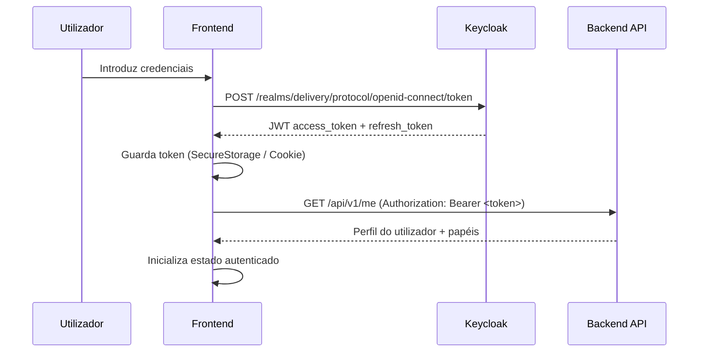
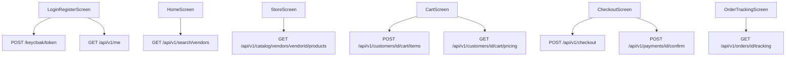
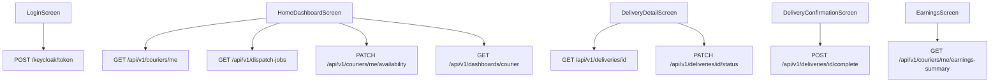
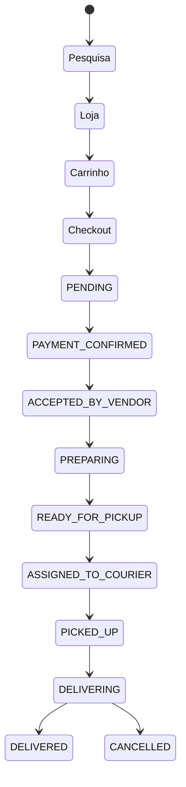
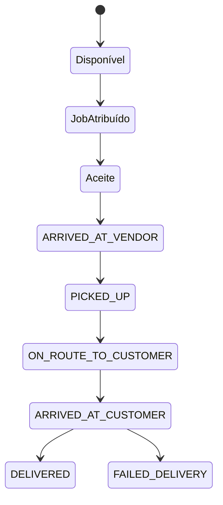

# Pede Aqui — Alinhamento de Ecrãs com Backend: Visão Geral e Arquitectura

# Pede Aqui — Alinhamento de Ecrãs com Backend: Visão Geral e Arquitectura

## Objectivo

Conectar os ecrãs existentes das três aplicações ao backend real, substituindo todos os dados mock/estáticos por chamadas à API, sem redesenhar a interface visual. O trabalho cobre inventário de ecrãs, mapeamento de rotas, mapeamento de APIs, casos de uso, fluxos de trabalho, papéis/permissões, gestão de estado, estados de carregamento/erro/vazio, validação, localização em Português PT (variante Moçambique), formatação de moeda MZN/MT e prontidão para produção.

## Contexto do Projecto

**Plataforma**: Marketplace de entregas multi-tenant para Moçambique (Maputo)
**Idioma**: Português PT — variante `pt_MZ`
**Moeda**: Metical Moçambicano — símbolo `MT`, formato `1 250,00 MT`
**Telefone**: `+258 XX XXX XXXX`
**Endereço**: Formato moçambicano (Av. Julius Nyerere, 123, Polana, Maputo)

### Stack Técnica

| Componente | Tecnologia |
| --- | --- |
| Backend | Spring Boot 3.x, Java 21, PostgreSQL/PostGIS, Keycloak JWT |
| Backoffice | Next.js 14, TypeScript, Redux Toolkit, React Query, Tailwind CSS, shadcn/ui |
| App Cliente | Flutter (Dart 3.x), BLoC/Cubit, GetIt, Dio |
| App Estafeta | Flutter (Dart 3.x), BLoC/Cubit, Provider, Dio |
| Auth | Keycloak OAuth2/OIDC — JWT Bearer token |
| Base URL API | `http://localhost:8080/api/v1` (dev) |

## Papéis e Permissões

| Papel (Role) | Aplicação | Acesso |
| --- | --- | --- |
| `CUSTOMER` | App Cliente | Catálogo, carrinho, checkout, rastreamento, suporte |
| `VENDOR_ADMIN` | Backoffice | Dashboard vendedor, encomendas, catálogo, inventário |
| `VENDOR_STAFF` | Backoffice | Encomendas, inventário |
| `COURIER` | App Estafeta | Dashboard, entregas, ganhos, perfil |
| `ADMIN` | Backoffice | Admin central, tenants, zonas, políticas, auditoria |
| `OPS` | Backoffice | Dispatch, reatribuição de estafetas |
| `FINANCE` | Backoffice | Transacções, comissões, reembolsos, reconciliação |
| `SUPPORT` | Backoffice | Tickets de suporte, notas internas |

## Arquitectura de Autenticação



**Headers obrigatórios em todos os pedidos autenticados:**

```
Authorization: Bearer <jwt_token>
Content-Type: application/json
Accept: application/json
X-Correlation-Id: <uuid>
```

## Inventário Completo de Ecrãs

### App Cliente (`pede_aqui_delivery_app`)

| # | Ecrã | Ficheiro | Rota | Estado Actual |
| --- | --- | --- | --- | --- |
| 1 | Landing | `lib/features/catalog/presentation/landing_screen.dart` | `/landing` | ✅ Estático (sem API) |
| 2 | Onboarding | `lib/features/catalog/presentation/onboarding_screen.dart` | `/onboarding` | ✅ Estático (sem API) |
| 3 | Login/Registo | `lib/features/auth/presentation/login_register_screen.dart` | `/auth` | 🔄 Mock `AuthRepository` |
| 4 | Home | `lib/features/catalog/presentation/home_screen.dart` | `/home` | 🔄 Mock `CatalogRepository` |
| 5 | Loja | `lib/features/catalog/presentation/store_screen.dart` | `/store` | 🔄 Mock `CatalogRepository` |
| 6 | Carrinho | `lib/features/cart/presentation/cart_screen.dart` | `/cart` | 🔄 Mock `CartRepository` |
| 7 | Checkout | `lib/features/checkout/presentation/checkout_screen.dart` | `/checkout` | 🔄 Dados estáticos hardcoded |
| 8 | Checkout c/ Promoção | `lib/features/checkout/presentation/checkout_promotion_screen.dart` | `/checkout-promo` | 🔄 Dados estáticos |
| 9 | Rastreamento | `lib/features/orders/presentation/order_tracking_screen.dart` | `/order-tracking` | 🔄 Mock `OrderRepository` |

### App Estafeta (`pede_aqui_courier_app`)

| # | Ecrã | Ficheiro | Rota | Estado Actual |
| --- | --- | --- | --- | --- |
| 1 | Onboarding | `lib/presentation/screens/onboarding_screen.dart` | `/onboarding` | ✅ Estático |
| 2 | Login | `lib/presentation/screens/login_screen.dart` | `/login` | 🔄 Sem autenticação real |
| 3 | Dashboard Principal | `lib/presentation/screens/home_dashboard_screen.dart` | `/app` (tab 0) | 🔄 Mock cubits |
| 4 | Detalhe de Entrega | `lib/presentation/screens/delivery_detail_screen.dart` | `/delivery-detail` | 🔄 Mock |
| 5 | Confirmação de Entrega | `lib/presentation/screens/delivery_confirmation_screen.dart` | `/confirm-delivery` | 🔄 Mock |
| 6 | Ganhos | `lib/presentation/screens/earnings_screen.dart` | `/app` (tab 2) | 🔄 Mock cubits |
| 7 | Histórico | `lib/presentation/screens/history_screen.dart` | `/app` (tab 3) | 🔄 Mock |
| 8 | Perfil | `lib/presentation/screens/profile_screen.dart` | `/app` (tab 4) | 🔄 Mock |
| 9 | Notificações | `lib/presentation/screens/notifications_screen.dart` | `/notifications` | 🔄 Mock |
| 10 | Carteira | `lib/presentation/screens/wallet_screen.dart` | `/wallet` | 🔄 Mock |
| 11 | Definições | `lib/presentation/screens/settings_screen.dart` | `/settings` | ✅ Local |

### Backoffice (`pede-aqui-backoffice`)

| # | Ecrã | Rota Next.js | Tipo | Estado Actual |
| --- | --- | --- | --- | --- |
| 1 | Admin Central | `/admin` | Componente real | 🔄 Mock fallback |
| 2 | Vendedores | `/vendors` | Componente real | 🔄 Mock fallback |
| 3 | Finanças | `/finance` | A criar | ❌ Não implementado |
| 4 | Suporte | `/support` | A criar | ❌ Não implementado |
| 5 | Encomendas | `/orders` | A criar | ❌ Não implementado |
| 6 | Estafetas | `/couriers` | A criar | ❌ Não implementado |
| 7+ | Ecrãs Stitch | `/screens/[slug]` | HTML importado | 🔄 Renderiza HTML estático |

## Mapeamento API ↔ Ecrã

### App Cliente



### App Estafeta



## Fluxos de Trabalho Principais

### Fluxo de Encomenda (Cliente)



### Fluxo de Entrega (Estafeta)



## Estados de UI Obrigatórios

Todos os ecrãs que consomem dados da API devem implementar os quatro estados:

| Estado | Comportamento |
| --- | --- |
| **Carregamento** | `CircularProgressIndicator` (Flutter) / skeleton cards (Next.js) |
| **Erro** | Mensagem em PT + botão "Tentar novamente" |
| **Vazio** | Mensagem contextual em PT (ex: "Nenhuma encomenda encontrada.") |
| **Dados** | Conteúdo real da API |

## Regras de Localização

- **Idioma**: Português PT (`pt_MZ`)
- **Moeda**: `1 250,00 MT` — usar `NumberFormat.currency(locale: 'pt_MZ', symbol: 'MT')` (Flutter) / `Intl.NumberFormat('pt-PT', { style: 'currency', currency: 'MZN' })` (Next.js)
- **Datas**: `dd/mm/aaaa HH:mm`
- **Telefone**: `+258 84 123 4567`
- **Termos chave**: Encomenda (não Pedido), Estafeta (não Motorista), Palavra-passe (não Senha), Telemóvel (não Celular), Morada (não Endereço), Registar (não Cadastrar)

## Lacunas de API Identificadas

| Lacuna | Detalhe | Prioridade |
| --- | --- | --- |
| Lista de encomendas do cliente | `GET /api/v1/orders/customers/{customerId}` não existe | P1 |
| Pesquisa de produtos por categoria | Apenas listagem por vendedor disponível | P2 |
| URL de imagem nos DTOs de produto | Backend tem presigned URL mas não retorna URL directa | P2 |

## Princípios de Implementação

1. **Preservar o design visual** — não redesenhar ecrãs existentes
2. **Não inventar APIs** — se uma API não existe, marcar como em falta e propor o contrato
3. **Usar a arquitectura existente** — BLoC/Cubit + GetIt (Flutter), React Query + serviços (Next.js)
4. **Sem over-engineering** — sem padrões proibidos (DDD, Clean Architecture, CQRS, Kafka)
5. **Dados mock como fallback** — manter mock durante transição, activar API via `USE_MOCK_DATA=false`