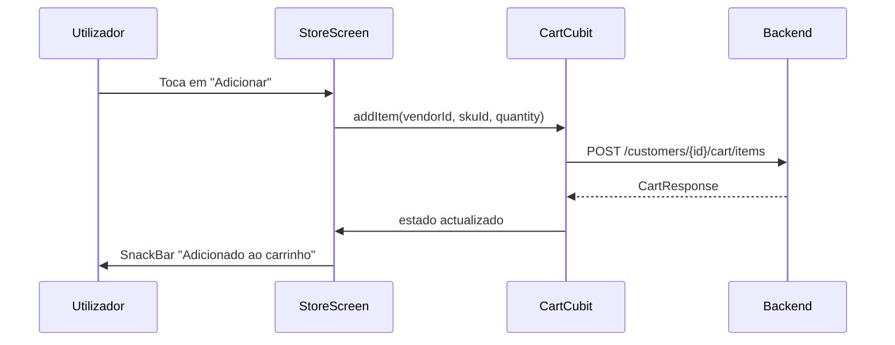
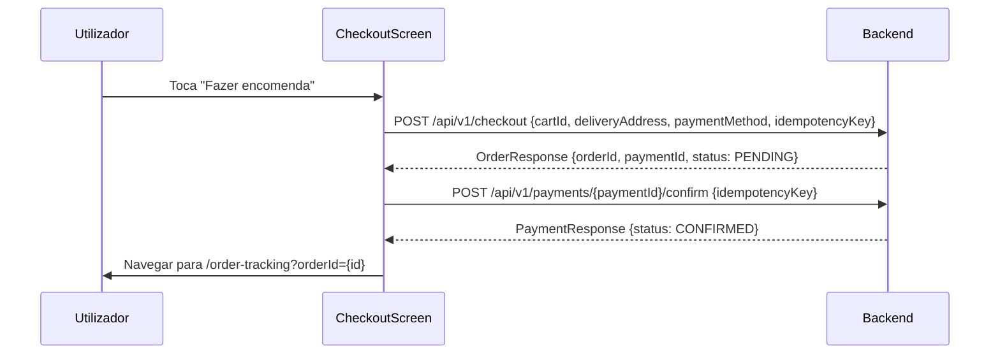

# Spec: App Cliente — Integração com Backend API

# App Cliente (`pede_aqui_delivery_app`) — Integração com Backend API

**Ficheiros relevantes**: file:pede_aqui_delivery_app/lib/
**Arquitectura**: Flutter BLoC/Cubit + GetIt + Dio
**Repositórios mock**: já existem em cada feature; stubs de API já existem em `service_locator.dart`

## Estado Actual

O `service_locator.dart` já tem a estrutura correcta:

- `USE_MOCK_DATA=true` → usa `MockXxxRepository`
- `USE_MOCK_DATA=false` → usa `ApiXxxRepository`

Os `ApiXxxRepository` existem mas estão incompletos — precisam de implementar as chamadas reais à API.

## Ecrã 1: Login / Registo (`LoginRegisterScreen`)

**Ficheiro**: file:pede_aqui_delivery_app/lib/features/auth/presentation/login_register_screen.dart

### Problemas actuais

- Credenciais hardcoded (`felix@pedeaqui.co.mz` / `123456`)
- `MockAuthRepository` retorna utilizador fictício sem chamar Keycloak
- Botão "Continuar com Google" navega directamente para home sem autenticação
- Sem tratamento de erro visível ao utilizador
- Sem validação de formulário

### Integração necessária

| Acção | API | Notas |
| --- | --- | --- |
| Login | `POST /realms/delivery/protocol/openid-connect/token` (Keycloak) | `grant_type=password`, `client_id`, `username`, `password` |
| Registo | Keycloak Admin API ou endpoint dedicado | Ver lacuna abaixo |
| Verificar sessão | `GET /api/v1/me` | Ao arrancar a app |
| Guardar token | `flutter_secure_storage` | `access_token` + `refresh_token` |

**Lacuna de API**: Não existe endpoint de registo de cliente no backend. Proposta: `POST /api/v1/auth/register` com `{ name, email, password }` que cria utilizador no Keycloak e perfil em `app_user_profiles`.

### Validação

- Email: formato válido obrigatório
- Palavra-passe: mínimo 6 caracteres
- Nome (registo): obrigatório, mínimo 2 caracteres
- Mensagens de erro em PT: "Email inválido", "Palavra-passe incorrecta", "Conta não encontrada"

### Estados de UI

- **Carregamento**: botão com `CircularProgressIndicator` (já implementado via `state.loading`)
- **Erro**: `SnackBar` com mensagem em PT
- **Sucesso**: navegar para `/home` e limpar stack

## Ecrã 2: Home (`HomeScreen`)

**Ficheiro**: file:pede_aqui_delivery_app/lib/features/catalog/presentation/home_screen.dart

### Problemas actuais

- Nome "Felix" hardcoded
- Localização "Av. Julius Nyerere" hardcoded
- Vendedores e categorias vêm de `MockCatalogRepository`
- Barra de pesquisa não funciona
- Ícone de notificações não funciona

### Integração necessária

| Dado | API | Notas |
| --- | --- | --- |
| Nome do utilizador | `GET /api/v1/me` → `name` | Guardar no `AuthState` |
| Lista de vendedores | `GET /api/v1/search/vendors?lat=&lng=&available=true` | Filtrar por disponibilidade |
| Pesquisa | `GET /api/v1/search/vendors?q=<termo>` | Debounce 300ms |
| Categorias | `GET /api/v1/catalog/categories` (ver lacuna) |  |
| Notificações | `GET /api/v1/notifications` | Badge com contagem não lidas |

**Lacuna de API**: Não existe endpoint de categorias globais. Proposta: `GET /api/v1/catalog/categories` retorna lista de categorias com `id`, `name`, `icon`.

### Mapeamento de dados (`VendorCard`)

| Campo UI | Campo API |
| --- | --- |
| Nome | `vendor.name` |
| Categoria | `vendor.category` |
| Tempo estimado | `vendor.estimatedDeliveryMinutes` |
| Disponível | `vendor.available` |
| Avaliação | `vendor.rating` (se disponível) |

### Estados de UI

- **Carregamento**: skeleton de 3 `VendorCard` horizontais
- **Erro**: banner "Não foi possível carregar vendedores. Tentar novamente."
- **Vazio**: "Nenhum vendedor disponível na sua área."
- **Pesquisa vazia**: "Nenhum resultado para «{termo}»."

## Ecrã 3: Loja (`StoreScreen`)

**Ficheiro**: file:pede_aqui_delivery_app/lib/features/catalog/presentation/store_screen.dart

### Integração necessária

| Dado | API |
| --- | --- |
| Produtos do vendedor | `GET /api/v1/catalog/vendors/{vendorId}/products` |
| Adicionar ao carrinho | `POST /api/v1/customers/{customerId}/cart/items` |

### Fluxo de adicionar ao carrinho



### Validação

- Não permitir adicionar produtos de vendedores diferentes (carrinho single-vendor)
- Mostrar aviso: "O seu carrinho tem itens de outro vendedor. Deseja limpar e continuar?"

## Ecrã 4: Carrinho (`CartScreen`)

**Ficheiro**: file:pede_aqui_delivery_app/lib/features/cart/presentation/cart_screen.dart

### Problemas actuais

- Morada de entrega hardcoded ("Av. Julius Nyerere, 123, Polana")
- Preços calculados localmente no mock
- `updateQuantity` não chama API

### Integração necessária

| Acção | API |
| --- | --- |
| Carregar carrinho | `GET /api/v1/customers/{customerId}/cart/pricing` |
| Actualizar quantidade | `PATCH /api/v1/customers/{customerId}/cart/items/{itemId}` com `{ quantity }` |
| Remover item | `DELETE /api/v1/customers/{customerId}/cart/items/{itemId}` (ver lacuna) |

**Lacuna de API**: Não existe endpoint de remoção de item. Proposta: `DELETE /api/v1/customers/{customerId}/cart/items/{itemId}` ou `PATCH` com `quantity: 0`.

### Formatação de moeda

- Subtotal, taxa de entrega, total: `1 250,00 MT`
- Usar `MoneyText` widget já existente — verificar se usa `NumberFormat.currency(locale: 'pt_MZ', symbol: 'MT')`

## Ecrã 5: Checkout (`CheckoutScreen`)

**Ficheiro**: file:pede_aqui_delivery_app/lib/features/checkout/presentation/checkout_screen.dart

### Problemas actuais

- Itens hardcoded (Amoxicilina, Vitamina C)
- Valores hardcoded (subtotal 1090, taxa 120, total 1210)
- Método de pagamento não funcional (M-Pesa / Dinheiro)
- Código promocional não funcional
- Botão "Fazer encomenda" navega directamente para rastreamento sem criar encomenda

### Integração necessária



### Campos do `CheckoutRequest`

```
cartId, customerId, deliveryAddress { street, district, city },
paymentMethod (MPESA | CASH), idempotencyKey (UUID gerado no cliente)
```

### Validação

- Morada de entrega obrigatória
- Método de pagamento obrigatório
- Idempotency key gerado automaticamente (UUID v4)

## Ecrã 6: Rastreamento de Encomenda (`OrderTrackingScreen`)

**Ficheiro**: file:pede_aqui_delivery_app/lib/features/orders/presentation/order_tracking_screen.dart

### Problemas actuais

- Referência hardcoded "PA-2026-00891"
- Código de entrega hardcoded "472981"
- Nome do estafeta hardcoded "KM"
- Tempo estimado hardcoded
- Sem polling/actualização automática

### Integração necessária

| Dado | API |
| --- | --- |
| Estado e código | `GET /api/v1/orders/{orderId}/tracking` |
| Polling automático | A cada 15 segundos enquanto ecrã activo |

### Resposta esperada (`TrackingResponse`)

```
orderId, reference, status, estimatedMinutes,
deliveryCode (6 dígitos), courierName, steps[]
```

### Lacuna de API

Não existe `GET /api/v1/orders/customers/{customerId}` para listar encomendas do cliente. Proposta de contrato:

```
GET /api/v1/orders/mine
Response: OrderResponse[] (filtrado pelo JWT do cliente)
```

### Estados de UI

- **Carregamento**: skeleton do mapa + timeline
- **Entregue**: mostrar código usado, botão "Avaliar"
- **Cancelado**: mostrar motivo, botão "Contactar suporte"

## Requisitos de Teste

| Teste | Tipo | Prioridade |
| --- | --- | --- |
| Login com credenciais válidas | Widget test | P1 |
| Login com credenciais inválidas → erro PT | Widget test | P1 |
| Adicionar item ao carrinho | Unit test (CartCubit) | P1 |
| Checkout → criar encomenda → confirmar pagamento | Integration test | P1 |
| Polling de rastreamento | Unit test (OrderTrackingCubit) | P2 |
| Formatação de moeda MZN | Unit test | P1 |