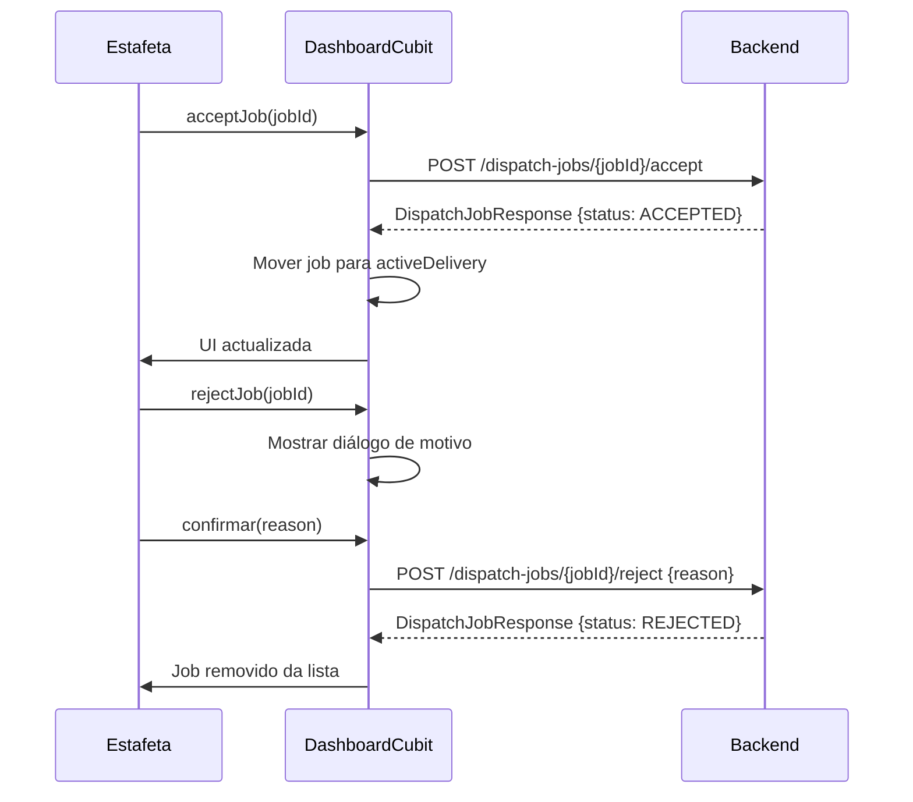
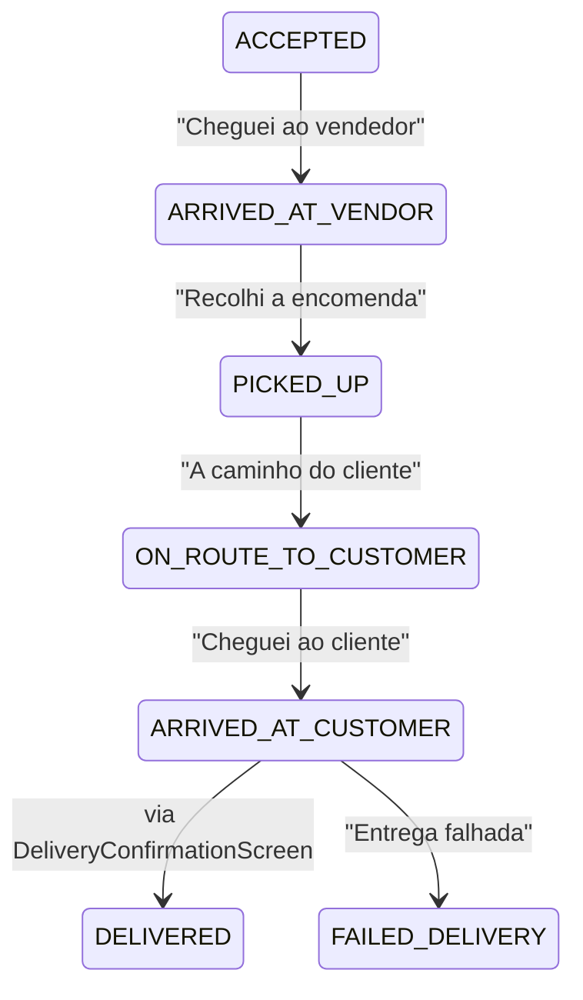

# Spec: App Estafeta — Integração com Backend API

# App Estafeta (`pede_aqui_courier_app`) — Integração com Backend API

**Ficheiros relevantes**: file:pede_aqui_courier_app/lib/
**Arquitectura**: Flutter BLoC/Cubit + Provider + Dio
**Estado actual**: Cubits instanciados directamente sem injecção de dependências; sem repositórios reais

## Problema Principal de Arquitectura

Ao contrário da app cliente, a app estafeta **não tem** um `service_locator.dart` nem repositórios abstractos. Os cubits são instanciados directamente no `ShellScreen` ou via `Provider`. É necessário:

1. Criar `InjectionContainer` com GetIt (já está no `pubspec.yaml`)
2. Criar repositórios abstractos para cada domínio
3. Criar implementações API e Mock de cada repositório
4. Ligar cubits aos repositórios via GetIt

## Ecrã 1: Login (`LoginScreen`)

**Ficheiro**: file:pede_aqui_courier_app/lib/presentation/screens/login_screen.dart

### Problemas actuais

- Botão "Entrar" navega directamente para `/app` sem autenticação
- Campo de telefone não validado
- Sem `AuthCubit` ou repositório de auth

### Integração necessária

| Acção | API |
| --- | --- |
| Login por telefone | `POST /keycloak/token` com `username=+258XXXXXXXXX`, `password` |
| Verificar perfil | `GET /api/v1/couriers/me` — confirmar que é `COURIER` |
| Guardar token | `flutter_secure_storage` |

### Validação

- Telefone: formato `+258 XX XXX XXXX` obrigatório
- Palavra-passe: obrigatória
- Erro se papel não for `COURIER`: "Esta conta não tem acesso à app de estafeta."

## Ecrã 2: Dashboard Principal (`HomeDashboardScreen`)

**Ficheiro**: file:pede_aqui_courier_app/lib/presentation/screens/home_dashboard_screen.dart

### Problemas actuais

- `DashboardCubit` usa dados mock
- `EarningsCubit` usa dados mock (valor hardcoded `1250`)
- `ProfileCubit` usa nome hardcoded "Félix"
- Toggle de disponibilidade não chama API

### Integração necessária

| Dado | API |
| --- | --- |
| Perfil do estafeta | `GET /api/v1/couriers/me` |
| Dashboard | `GET /api/v1/dashboards/courier` |
| Jobs disponíveis | `GET /api/v1/dispatch-jobs?status=PENDING` |
| Toggle disponibilidade | `PATCH /api/v1/couriers/me/availability` com `{ available: true/false }` |
| Aceitar job | `POST /api/v1/dispatch-jobs/{jobId}/accept` |
| Rejeitar job | `POST /api/v1/dispatch-jobs/{jobId}/reject` com `{ reason }` |

### Fluxo de aceitar/rejeitar job



### Polling

- Jobs disponíveis: polling a cada 30 segundos quando `available=true`
- Entrega activa: polling a cada 15 segundos

## Ecrã 3: Detalhe de Entrega (`DeliveryDetailScreen`)

**Ficheiro**: file:pede_aqui_courier_app/lib/presentation/screens/delivery_detail_screen.dart

### Integração necessária

| Acção | API |
| --- | --- |
| Carregar entrega | `GET /api/v1/deliveries/{deliveryId}` |
| Actualizar estado | `PATCH /api/v1/deliveries/{deliveryId}/status` |

### Progressão de estados



### Labels em PT

| Status | Label PT |
| --- | --- |
| `ACCEPTED` | Aceite |
| `ARRIVED_AT_VENDOR` | No vendedor |
| `PICKED_UP` | Recolhido |
| `ON_ROUTE_TO_CUSTOMER` | A caminho |
| `ARRIVED_AT_CUSTOMER` | No cliente |
| `DELIVERED` | Entregue |
| `FAILED_DELIVERY` | Falhou |

## Ecrã 4: Confirmação de Entrega (`DeliveryConfirmationScreen`)

**Ficheiro**: file:pede_aqui_courier_app/lib/presentation/screens/delivery_confirmation_screen.dart

### Integração necessária

| Acção | API |
| --- | --- |
| Submeter código | `POST /api/v1/deliveries/{deliveryId}/complete` com `{ confirmationCode: "XXXXXX" }` |

### Comportamento

- Input de 6 dígitos numéricos
- Erro se código inválido: "Código incorrecto. Verifique com o cliente."
- Sucesso: navegar para dashboard, mostrar ganho da entrega
- Opção de registar prova fotográfica (upload para S3 via `POST /api/v1/uploads`)

## Ecrã 5: Ganhos (`EarningsScreen`)

**Ficheiro**: file:pede_aqui_courier_app/lib/presentation/screens/earnings_screen.dart

### Problemas actuais

- `EarningsCubit` usa dados mock
- Valor "Bónus Turbo" hardcoded (não existe no backend)

### Integração necessária

| Dado | API |
| --- | --- |
| Resumo de ganhos | `GET /api/v1/couriers/me/earnings-summary` |

### Resposta esperada (`CourierEarningsSummaryResponse`)

```
completedDeliveries, failedDeliveries, totalEarnings, today, thisWeek
```

### Nota sobre "Bónus Turbo"

O backend não tem endpoint de bónus. Manter o card como elemento visual estático (marketing) ou remover. **Não inventar API.**

### Formatação

- Todos os valores monetários: `1 250,00 MT`
- Gráfico semanal: dias em PT (Seg, Ter, Qua, Qui, Sex, Sáb, Dom)

## Ecrã 6: Notificações (`NotificationsScreen`)

**Ficheiro**: file:pede_aqui_courier_app/lib/presentation/screens/notifications_screen.dart

### Integração necessária

| Acção | API |
| --- | --- |
| Listar notificações | `GET /api/v1/notifications` |
| Marcar como lida | `PATCH /api/v1/notifications/{id}/read` |

## Requisitos de Teste

| Teste | Tipo | Prioridade |
| --- | --- | --- |
| Login com telefone válido | Widget test | P1 |
| Toggle disponibilidade | Unit test (DashboardCubit) | P1 |
| Aceitar job → estado actualizado | Unit test | P1 |
| Progressão de estados de entrega | Unit test | P1 |
| Confirmação com código correcto | Unit test | P1 |
| Confirmação com código errado → erro PT | Unit test | P1 |
| Formatação de ganhos em MZN | Unit test | P1 |