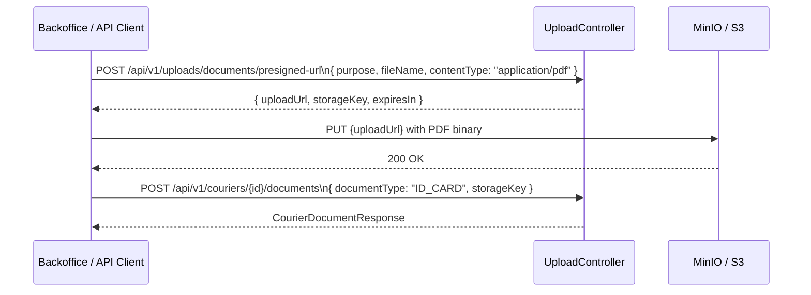

# Backend: Document upload for PDFs + Courier admin endpoints + CourierDocument entity

## Context

Spec: spec:d6648bb2-0f16-4dd6-83a0-f75e9b0603c8/7dec321e-620b-4153-97fd-68510885a5f5

This ticket adds the missing API surface: a document presigned-URL upload endpoint (supporting PDF), a full admin-facing Courier CRUD, and the `CourierDocument` entity/repository/service layer.

## Files to change

| File | Action |
| --- | --- |
| file:pede-aqui/backend/backend/src/main/java/com/delivery/upload/controller/UploadController.java | **Extend** |
| file:pede-aqui/backend/backend/src/main/java/com/delivery/upload/service/UploadService.java | **Extend** |
| file:pede-aqui/backend/backend/src/main/java/com/delivery/upload/dto/CreateUploadUrlRequest.java | **Verify / no change needed** |
| file:pede-aqui/backend/backend/src/main/java/com/delivery/dispatch/entity/CourierDocument.java | **Create** |
| file:pede-aqui/backend/backend/src/main/java/com/delivery/dispatch/repository/CourierDocumentRepository.java | **Create** |
| file:pede-aqui/backend/backend/src/main/java/com/delivery/dispatch/dto/CreateCourierRequest.java | **Create** |
| file:pede-aqui/backend/backend/src/main/java/com/delivery/dispatch/dto/CreateCourierDocumentRequest.java | **Create** |
| file:pede-aqui/backend/backend/src/main/java/com/delivery/dispatch/dto/CourierDocumentResponse.java | **Create** |
| file:pede-aqui/backend/backend/src/main/java/com/delivery/dispatch/service/CourierService.java | **Extend** |
| file:pede-aqui/backend/backend/src/main/java/com/delivery/dispatch/mapper/DispatchMapper.java | **Extend** |
| file:pede-aqui/backend/backend/src/main/java/com/delivery/dispatch/controller/CourierController.java | **Extend** |

## Acceptance Criteria

### 1. Document presigned-URL endpoint

**`UploadService`** — new method `createDocumentUploadUrl(CreateUploadUrlRequest request)`:

- Accepted content types: `application/pdf`, `image/jpeg`, `image/png`, `image/webp`
- Storage key pattern: `tenants/{tenantId}/documents/{purpose}/{userId}/{timestamp}-{sanitizedFileName}.{ext}`
- Extension mapping: `application/pdf` → `pdf`, images as before

**`UploadController`** — new endpoint:

```
POST /api/v1/uploads/documents/presigned-url
@ResponseStatus(CREATED)
Roles: any authenticated user
```

Returns `UploadUrlResponse` (same record as image upload).

### 2. `CourierDocument` entity

New JPA entity mapped to the `courier_documents` table (created in V012 migration — see companion ticket):

- Fields: `id` (UUID), `tenantId`, `courierId`, `documentType`, `storageKey`, `status`, `createdAt`, `updatedAt`
- Constructor sets `status = "PENDING"` and timestamps
- Getters for all fields

**`CourierDocumentRepository`** — `JpaRepository<CourierDocument, UUID>` with method `findAllByCourierIdAndTenantId(UUID courierId, UUID tenantId)`.

### 3. New Courier admin endpoints

**`CreateCourierRequest`** record:

- `@NotNull UUID userProfileId`
- `UUID operatingZoneId` (optional)
- `String fullName`, `String phone`, `String nif`, `String vehicleType`, `String vehiclePlate`
- `LocalDate dateOfBirth`

**`CreateCourierDocumentRequest`** record:

- `@NotBlank String documentType`
- `@NotBlank String storageKey`

**`CourierDocumentResponse`** record:

- `UUID id`, `UUID courierId`, `String documentType`, `String storageKey`, `String status`, `Instant createdAt`

**`CourierService`** — new methods:

- `create(CreateCourierRequest request)` → creates and saves a `Courier`, returns `CourierResponse`
- `listAll()` → returns `List<CourierResponse>` for all couriers in the current tenant
- `getById(UUID courierId)` → returns `CourierResponse` or throws `NotFoundException`
- `addDocument(UUID courierId, CreateCourierDocumentRequest request)` → creates and saves `CourierDocument`, returns `CourierDocumentResponse`
- `listDocuments(UUID courierId)` → returns `List<CourierDocumentResponse>`

**`DispatchMapper`** — new mapping methods for `CourierDocument` → `CourierDocumentResponse`.

**`CourierController`** — new endpoints (all under `/api/v1/couriers`):

| Method | Path | Role | Description |
| --- | --- | --- | --- |
| `POST` | `/` | `ADMIN`, `OPERATIONS` | Create courier profile |
| `GET` | `/` | `ADMIN`, `OPERATIONS` | List all couriers in tenant |
| `GET` | `/{courierId}` | `ADMIN`, `OPERATIONS` | Get courier by ID |
| `POST` | `/{courierId}/documents` | `ADMIN`, `OPERATIONS` | Attach document |
| `GET` | `/{courierId}/documents` | `ADMIN`, `OPERATIONS` | List courier documents |

Existing endpoints (`/me`, `/{courierId}/availability`) are unchanged.

### 4. Upload flow



### 5. Security

All new courier admin endpoints use `@PreAuthorize("hasAnyRole('ADMIN','OPERATIONS')")`.

The document presigned-URL endpoint requires authentication but no specific role (any authenticated user can request an upload URL for their own files).