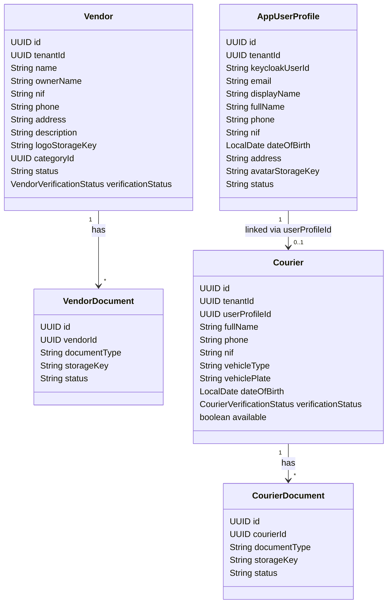
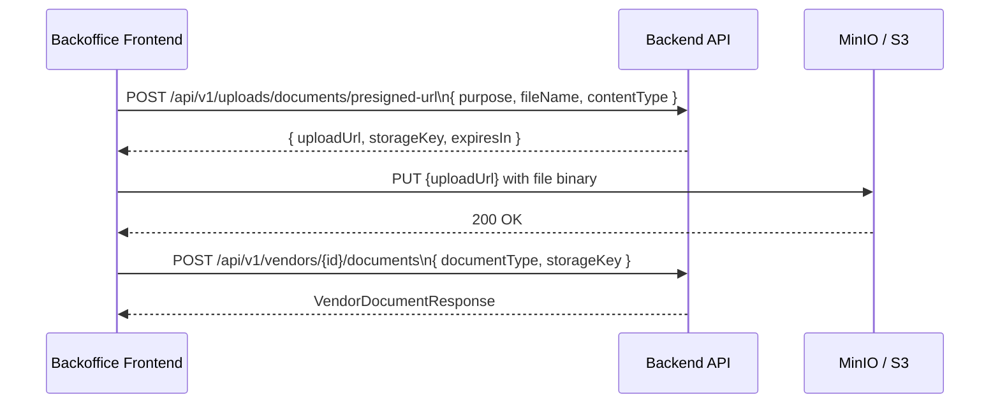

# Rich Profiles & Document Attachment — Vendors, Couriers & Users

## Overview

Refactor the data model and API for **Vendors**, **Couriers**, and **Users** to capture richer profile information, and build backoffice forms that allow operators to create/edit these entities with all required fields and attach the necessary documents (business licence, ID card, vehicle registration, etc.).

The upload infrastructure (MinIO/S3 presigned URLs) already exists. The work extends it to support document file types (PDF, images) and wires it into the new forms.

## Scope

| Layer | What changes |
| --- | --- |
| Backend — DB migrations | New columns on `vendors`, `couriers`, `app_user_profiles`; new `courier_documents` table |
| Backend — Entities & DTOs | Richer fields on `Vendor`, `Courier`, `AppUserProfile`; new request/response DTOs |
| Backend — Upload service | Accept PDF content-type; add a `/documents/presigned-url` endpoint |
| Backend — Courier API | `POST /api/v1/couriers` (admin creates courier profile); `GET /api/v1/couriers/{id}` |
| Backoffice — Vendor page | Rich create/edit form with document attachment |
| Backoffice — Courier page | Dedicated rich form replacing the generic `ManagementCrudPage` |
| Backoffice — Users page | New page for listing and creating user profiles with extended fields |

## 1. Extended Data Model

### 1.1 Vendor — new fields

| Field | Type | Notes |
| --- | --- | --- |
| `owner_name` | `VARCHAR(160)` | Legal owner / representative name |
| `nif` | `VARCHAR(30)` | Tax identification number |
| `phone` | `VARCHAR(40)` | Contact phone |
| `address` | `VARCHAR(300)` | Physical address |
| `description` | `TEXT` | Short description shown to customers |
| `logo_storage_key` | `VARCHAR(300)` | S3 key for logo image |

`vendor_documents` already exists in `V006__vendors.sql` and supports arbitrary `document_type` + `storage_key`. No schema change needed there.

### 1.2 Courier — new fields

| Field | Type | Notes |
| --- | --- | --- |
| `full_name` | `VARCHAR(160)` | Courier's full legal name |
| `phone` | `VARCHAR(40)` | Contact phone |
| `nif` | `VARCHAR(30)` | Tax ID |
| `vehicle_type` | `VARCHAR(60)` | e.g. `MOTORCYCLE`, `BICYCLE`, `CAR` |
| `vehicle_plate` | `VARCHAR(30)` | Licence plate |
| `date_of_birth` | `DATE` | For age verification |

New table **`courier_documents`** (mirrors `vendor_documents`):

| Column | Type |
| --- | --- |
| `id` | `UUID PK` |
| `tenant_id` | `UUID FK tenants` |
| `courier_id` | `UUID FK couriers` |
| `document_type` | `VARCHAR(80)` |
| `storage_key` | `VARCHAR(300)` |
| `status` | `VARCHAR(30)` |
| `created_at` | `TIMESTAMPTZ` |
| `updated_at` | `TIMESTAMPTZ` |

### 1.3 AppUserProfile — new fields

| Field | Type | Notes |
| --- | --- | --- |
| `full_name` | `VARCHAR(160)` | Legal full name (separate from `display_name`) |
| `nif` | `VARCHAR(30)` | Tax ID |
| `date_of_birth` | `DATE` |  |
| `address` | `VARCHAR(300)` |  |
| `avatar_storage_key` | `VARCHAR(300)` | S3 key for profile picture |

## 2. Backend Changes

### 2.1 Flyway migration — `V012__rich_profiles.sql`

Adds the new columns to `vendors`, `couriers`, and `app_user_profiles`, and creates the `courier_documents` table.

### 2.2 Upload service — document support

Extend `UploadService` and `UploadController` to support a second endpoint:

```
POST /api/v1/uploads/documents/presigned-url
Body: { purpose, fileName, contentType }
```

Accepted content types: `application/pdf`, `image/jpeg`, `image/png`, `image/webp`.
Storage key pattern: `tenants/{tenantId}/documents/{purpose}/{userId}/{timestamp}-{fileName}.{ext}`

**Access:** Restricted to roles `ADMIN`, `OPERATIONS`, `VENDOR_ADMIN`, `VENDOR_STAFF`, `COURIER`.

### 2.3 Vendor API changes

**`CreateVendorRequest`** gains: `ownerName`, `nif`, `phone` (**required** — `@NotBlank`), `address`, `description`, `logoStorageKey`.

**`UpdateVendorProfileRequest`** gains the same fields (all optional for updates).

**`VendorResponse`** exposes all new fields.

**`VendorService.create()`** persists the new fields.

**Document types** — validated against an allowed list stored as `VARCHAR` (no DB enum). Allowed values for vendor documents: `BUSINESS_LICENCE`, `TAX_CERTIFICATE`, `HEALTH_PERMIT`, `OTHER`. The service throws a `BusinessException` for unknown types.

### 2.4 Courier API changes

New endpoint: `POST /api/v1/couriers` (roles: `ADMIN`, `OPERATIONS`, or the courier themselves — `COURIER` role creating their own profile).
New endpoint: `GET /api/v1/couriers/{courierId}` (role `ADMIN`, `OPERATIONS`).
New endpoint: `POST /api/v1/couriers/{courierId}/documents` (role `ADMIN`, `OPERATIONS`).
New endpoint: `GET /api/v1/couriers/{courierId}/documents` (role `ADMIN`, `OPERATIONS`).

**`CreateCourierRequest`**: `userProfileId` (required), `operatingZoneId`, `fullName`, `phone`, `nif` (**required** — `@NotBlank`), `vehicleType`, `vehiclePlate`, `dateOfBirth`.

**`CourierResponse`** gains: `fullName`, `phone`, `nif`, `vehicleType`, `vehiclePlate`, `rating`, `totalDeliveries`.

**Document types** — validated against an allowed list stored as `VARCHAR`. Allowed values for courier documents: `ID_CARD`, `DRIVING_LICENCE`, `VEHICLE_REGISTRATION`, `OTHER`. The service throws a `BusinessException` for unknown types.

### 2.5 User Profile API changes

New admin endpoint: `POST /api/v1/admin/users` — creates a user profile (roles: `ADMIN`, `SUPPORT`).
New admin endpoint: `GET /api/v1/admin/users` — lists all user profiles in the tenant (roles: `ADMIN`, `SUPPORT`).
New admin endpoint: `GET /api/v1/admin/users/{id}` — gets a single user profile (roles: `ADMIN`, `SUPPORT`).

**`CreateUserProfileRequest`**: `keycloakUserId`, `email`, `displayName`, `fullName`, `phone`, `nif`, `dateOfBirth`, `address`, `roles`.

**`UserProfileResponse`** (new DTO, distinct from `MeResponse`): all fields including new ones.

**NIF uniqueness** — `UNIQUE (tenant_id, nif)` constraint added to `app_user_profiles` in V012 migration. The service catches the constraint violation and throws a `BusinessException` with code `nif_already_registered`.

## 3. Entity Relationship (updated)



## 4. Backoffice Frontend Changes

### 4.1 Vendor Form — Rich Create/Edit

Replace the current 3-field vendor form in file:pede-aqui-backoffice/src/app/vendors/page.tsx with a full form panel.

**Fields:**

- Nome do vendedor (required)
- Nome do proprietário
- NIF
- Telefone
- Endereço
- Descrição
- Categoria (dropdown)
- Estado
- Logótipo (file upload → presigned URL → store key)
- Documentos (multi-document upload: Licença Comercial, Alvará, etc.)

**Document upload flow:**

1. User selects a file
2. Frontend calls `POST /api/v1/uploads/documents/presigned-url`
3. Frontend PUTs the file directly to the returned URL
4. Frontend calls `POST /api/v1/vendors/{id}/documents` with `{ documentType, storageKey }`

### 4.2 Courier Page — Dedicated Rich Form

Replace file:pede-aqui-backoffice/src/app/couriers/page.tsx (currently using generic `ManagementCrudPage`) with a dedicated page and form.

**Fields:**

- Nome completo (required)
- Telefone
- NIF
- Data de nascimento
- Tipo de veículo (dropdown: Mota, Bicicleta, Carro)
- Matrícula
- Zona operacional (dropdown)
- Documentos (BI/Passaporte, Carta de Condução, Registo do Veículo)

### 4.3 Users Page — New Page

New page at file:pede-aqui-backoffice/src/app/users/page.tsx.

**Fields:**

- Nome de exibição (required)
- Nome completo
- Email (required)
- Telefone
- NIF
- Data de nascimento
- Endereço
- Papel/Role (dropdown: ADMIN, VENDOR_ADMIN, VENDOR_STAFF, COURIER, CUSTOMER, OPERATIONS, FINANCE, SUPPORT)
- Foto de perfil (file upload)

### 4.4 API service layer updates

Extend file:pede-aqui-backoffice/src/lib/api/services.ts:

- `vendorService.create()` — updated payload with new fields
- `vendorService.uploadDocument()` — calls presigned URL endpoint then registers document
- `courierService.list()`, `courierService.create()`, `courierService.addDocument()`
- `userService.list()`, `userService.create()`

Extend file:pede-aqui-backoffice/src/lib/api/types.ts with updated `Vendor`, `Courier`, and new `UserProfile` types.

## 5. Wireframes

### 5.1 Vendor Create/Edit Form

```wireframe

<html>
<head>
<style>
* { box-sizing: border-box; margin: 0; padding: 0; font-family: sans-serif; font-size: 14px; }
body { background: #f5f5f5; padding: 24px; }
.page { max-width: 1100px; margin: 0 auto; }
h1 { font-size: 22px; font-weight: 700; margin-bottom: 4px; }
p.sub { color: #666; margin-bottom: 20px; }
.grid { display: grid; grid-template-columns: 2fr 1fr; gap: 16px; }
.card { background: #fff; border-radius: 12px; border: 1px solid #e0e0e0; padding: 20px; }
.card h2 { font-size: 15px; font-weight: 700; margin-bottom: 16px; border-bottom: 1px solid #eee; padding-bottom: 10px; }
.form-row { display: grid; grid-template-columns: 1fr 1fr; gap: 12px; margin-bottom: 12px; }
.form-group { display: flex; flex-direction: column; gap: 4px; margin-bottom: 12px; }
label { font-size: 12px; font-weight: 600; color: #444; }
input, select, textarea { border: 1px solid #d0d0d0; border-radius: 8px; padding: 8px 10px; font-size: 13px; width: 100%; }
textarea { height: 72px; resize: vertical; }
.upload-zone { border: 2px dashed #c0c0c0; border-radius: 8px; padding: 16px; text-align: center; color: #888; cursor: pointer; margin-bottom: 12px; }
.upload-zone span { display: block; font-size: 12px; margin-top: 4px; }
.doc-item { display: flex; align-items: center; justify-content: space-between; background: #f9f9f9; border: 1px solid #e0e0e0; border-radius: 8px; padding: 8px 12px; margin-bottom: 8px; }
.doc-item .doc-name { font-weight: 600; font-size: 12px; }
.doc-item .doc-status { font-size: 11px; color: #888; }
.badge { display: inline-block; padding: 2px 8px; border-radius: 20px; font-size: 11px; font-weight: 600; }
.badge-pending { background: #fff3cd; color: #856404; }
.btn { padding: 9px 18px; border-radius: 8px; border: none; cursor: pointer; font-weight: 600; font-size: 13px; }
.btn-primary { background: #1a1a2e; color: #fff; width: 100%; margin-top: 4px; }
.btn-outline { background: #fff; border: 1px solid #d0d0d0; color: #333; width: 100%; margin-top: 6px; }
.section-label { font-size: 12px; font-weight: 700; color: #555; text-transform: uppercase; letter-spacing: 0.5px; margin-bottom: 8px; margin-top: 4px; }
.logo-preview { width: 64px; height: 64px; border-radius: 10px; background: #eee; border: 1px solid #ddd; display: flex; align-items: center; justify-content: center; color: #aaa; font-size: 11px; margin-bottom: 8px; }
</style>
</head>
<body>
<div class="page">
  <h1>Vendedores</h1>
  <p class="sub">Gestão de vendedores do marketplace.</p>
  <div class="grid">

    <div class="card">
      <h2>Lista de Vendedores</h2>
      <table style="width:100%;border-collapse:collapse;font-size:13px;">
        <thead>
          <tr style="border-bottom:1px solid #eee;color:#888;font-size:11px;text-transform:uppercase;">
            <th style="padding:8px 8px 8px 0;text-align:left;">Nome</th>
            <th style="padding:8px;text-align:left;">Categoria</th>
            <th style="padding:8px;text-align:left;">Estado</th>
            <th style="padding:8px;text-align:left;">Verificação</th>
            <th style="padding:8px;text-align:left;">Acções</th>
          </tr>
        </thead>
        <tbody>
          <tr style="border-bottom:1px solid #f0f0f0;">
            <td style="padding:10px 8px 10px 0;font-weight:700;">Restaurante Central</td>
            <td style="padding:10px 8px;color:#666;">Restaurante</td>
            <td style="padding:10px 8px;"><span class="badge" style="background:#d4edda;color:#155724;">Activo</span></td>
            <td style="padding:10px 8px;"><span class="badge badge-pending">Pendente</span></td>
            <td style="padding:10px 8px;"><button class="btn btn-outline" style="width:auto;padding:4px 10px;font-size:12px;">Editar</button></td>
          </tr>
          <tr style="border-bottom:1px solid #f0f0f0;">
            <td style="padding:10px 8px 10px 0;font-weight:700;">Farmácia Baixa</td>
            <td style="padding:10px 8px;color:#666;">Farmácia</td>
            <td style="padding:10px 8px;"><span class="badge" style="background:#d4edda;color:#155724;">Activo</span></td>
            <td style="padding:10px 8px;"><span class="badge" style="background:#d4edda;color:#155724;">Aprovado</span></td>
            <td style="padding:10px 8px;"><button class="btn btn-outline" style="width:auto;padding:4px 10px;font-size:12px;">Editar</button></td>
          </tr>
        </tbody>
      </table>
    </div>

    <div class="card">
      <h2>Criar Vendedor</h2>
      <div class="section-label">Logótipo</div>
      <div class="logo-preview">Logo</div>
      <div class="upload-zone" data-element-id="logo-upload">
        📁 Clique para carregar logótipo
        <span>PNG, JPG, WEBP · máx. 2 MB</span>
      </div>
      <div class="form-group">
        <label>Nome do Vendedor *</label>
        <input type="text" placeholder="Ex: Restaurante Central" />
      </div>
      <div class="form-group">
        <label>Nome do Proprietário</label>
        <input type="text" placeholder="Nome legal do proprietário" />
      </div>
      <div class="form-row">
        <div class="form-group" style="margin-bottom:0;">
          <label>NIF</label>
          <input type="text" placeholder="123456789" />
        </div>
        <div class="form-group" style="margin-bottom:0;">
          <label>Telefone</label>
          <input type="text" placeholder="+258 84 000 0000" />
        </div>
      </div>
      <div class="form-group" style="margin-top:12px;">
        <label>Endereço</label>
        <input type="text" placeholder="Rua, número, cidade" />
      </div>
      <div class="form-group">
        <label>Categoria</label>
        <select><option>Restaurante</option><option>Farmácia</option><option>Mercearia</option><option>Outro</option></select>
      </div>
      <div class="form-group">
        <label>Descrição</label>
        <textarea placeholder="Breve descrição do vendedor..."></textarea>
      </div>
      <div class="section-label" style="margin-top:4px;">Documentos</div>
      <div class="doc-item">
        <div>
          <div class="doc-name">Licença Comercial</div>
          <div class="doc-status">licenca-comercial.pdf</div>
        </div>
        <span class="badge badge-pending">Pendente</span>
      </div>
      <div class="upload-zone" data-element-id="doc-upload" style="margin-top:8px;">
        📎 Adicionar documento
        <span>PDF, PNG, JPG · seleccione o tipo</span>
      </div>
      <button class="btn btn-primary" data-element-id="submit-vendor">Criar Vendedor</button>
    </div>
  </div>
</div>
</body>
</html>
```

### 5.2 Courier Create/Edit Form

```wireframe

<html>
<head>
<style>
* { box-sizing: border-box; margin: 0; padding: 0; font-family: sans-serif; font-size: 14px; }
body { background: #f5f5f5; padding: 24px; }
.page { max-width: 1100px; margin: 0 auto; }
h1 { font-size: 22px; font-weight: 700; margin-bottom: 4px; }
p.sub { color: #666; margin-bottom: 20px; }
.grid { display: grid; grid-template-columns: 2fr 1fr; gap: 16px; }
.card { background: #fff; border-radius: 12px; border: 1px solid #e0e0e0; padding: 20px; }
.card h2 { font-size: 15px; font-weight: 700; margin-bottom: 16px; border-bottom: 1px solid #eee; padding-bottom: 10px; }
.form-row { display: grid; grid-template-columns: 1fr 1fr; gap: 12px; margin-bottom: 12px; }
.form-group { display: flex; flex-direction: column; gap: 4px; margin-bottom: 12px; }
label { font-size: 12px; font-weight: 600; color: #444; }
input, select { border: 1px solid #d0d0d0; border-radius: 8px; padding: 8px 10px; font-size: 13px; width: 100%; }
.upload-zone { border: 2px dashed #c0c0c0; border-radius: 8px; padding: 14px; text-align: center; color: #888; cursor: pointer; margin-bottom: 10px; }
.upload-zone span { display: block; font-size: 12px; margin-top: 4px; }
.doc-item { display: flex; align-items: center; justify-content: space-between; background: #f9f9f9; border: 1px solid #e0e0e0; border-radius: 8px; padding: 8px 12px; margin-bottom: 8px; }
.doc-item .doc-name { font-weight: 600; font-size: 12px; }
.doc-item .doc-status { font-size: 11px; color: #888; }
.badge { display: inline-block; padding: 2px 8px; border-radius: 20px; font-size: 11px; font-weight: 600; }
.badge-pending { background: #fff3cd; color: #856404; }
.btn { padding: 9px 18px; border-radius: 8px; border: none; cursor: pointer; font-weight: 600; font-size: 13px; }
.btn-primary { background: #1a1a2e; color: #fff; width: 100%; margin-top: 4px; }
.btn-outline { background: #fff; border: 1px solid #d0d0d0; color: #333; }
.section-label { font-size: 12px; font-weight: 700; color: #555; text-transform: uppercase; letter-spacing: 0.5px; margin-bottom: 8px; }
</style>
</head>
<body>
<div class="page">
  <h1>Estafetas</h1>
  <p class="sub">Listar, criar e gerir perfis de estafetas.</p>
  <div class="grid">
    <div class="card">
      <h2>Lista de Estafetas</h2>
      <table style="width:100%;border-collapse:collapse;font-size:13px;">
        <thead>
          <tr style="border-bottom:1px solid #eee;color:#888;font-size:11px;text-transform:uppercase;">
            <th style="padding:8px 8px 8px 0;text-align:left;">Nome</th>
            <th style="padding:8px;text-align:left;">Veículo</th>
            <th style="padding:8px;text-align:left;">Zona</th>
            <th style="padding:8px;text-align:left;">Estado</th>
            <th style="padding:8px;text-align:left;">Verificação</th>
            <th style="padding:8px;text-align:left;">Acções</th>
          </tr>
        </thead>
        <tbody>
          <tr style="border-bottom:1px solid #f0f0f0;">
            <td style="padding:10px 8px 10px 0;font-weight:700;">Mateus Tavares</td>
            <td style="padding:10px 8px;color:#666;">Mota</td>
            <td style="padding:10px 8px;color:#666;">Maputo Cidade</td>
            <td style="padding:10px 8px;"><span class="badge" style="background:#d4edda;color:#155724;">Online</span></td>
            <td style="padding:10px 8px;"><span class="badge" style="background:#d4edda;color:#155724;">Aprovado</span></td>
            <td style="padding:10px 8px;"><button class="btn btn-outline" style="padding:4px 10px;font-size:12px;">Editar</button></td>
          </tr>
          <tr style="border-bottom:1px solid #f0f0f0;">
            <td style="padding:10px 8px 10px 0;font-weight:700;">Celina Mabote</td>
            <td style="padding:10px 8px;color:#666;">Bicicleta</td>
            <td style="padding:10px 8px;color:#666;">Matola</td>
            <td style="padding:10px 8px;"><span class="badge" style="background:#f8d7da;color:#721c24;">Offline</span></td>
            <td style="padding:10px 8px;"><span class="badge badge-pending">Pendente</span></td>
            <td style="padding:10px 8px;"><button class="btn btn-outline" style="padding:4px 10px;font-size:12px;">Editar</button></td>
          </tr>
        </tbody>
      </table>
    </div>
    <div class="card">
      <h2>Criar Estafeta</h2>
      <div class="form-group">
        <label>Nome Completo *</label>
        <input type="text" placeholder="Nome legal completo" />
      </div>
      <div class="form-row">
        <div class="form-group" style="margin-bottom:0;">
          <label>Telefone</label>
          <input type="text" placeholder="+258 84 000 0000" />
        </div>
        <div class="form-group" style="margin-bottom:0;">
          <label>NIF</label>
          <input type="text" placeholder="123456789" />
        </div>
      </div>
      <div class="form-group" style="margin-top:12px;">
        <label>Data de Nascimento</label>
        <input type="date" />
      </div>
      <div class="form-row">
        <div class="form-group" style="margin-bottom:0;">
          <label>Tipo de Veículo</label>
          <select><option>Mota</option><option>Bicicleta</option><option>Carro</option></select>
        </div>
        <div class="form-group" style="margin-bottom:0;">
          <label>Matrícula</label>
          <input type="text" placeholder="MZ-00-00-AA" />
        </div>
      </div>
      <div class="form-group" style="margin-top:12px;">
        <label>Zona Operacional</label>
        <select><option>Maputo Cidade</option><option>Matola</option><option>Baixa</option></select>
      </div>
      <div class="form-group">
        <label>Perfil de Utilizador (ID)</label>
        <input type="text" placeholder="UUID do perfil de utilizador" />
      </div>
      <div class="section-label">Documentos</div>
      <div class="doc-item">
        <div>
          <div class="doc-name">Bilhete de Identidade</div>
          <div class="doc-status">bi-mateus.pdf</div>
        </div>
        <span class="badge" style="background:#d4edda;color:#155724;">OK</span>
      </div>
      <div class="upload-zone" data-element-id="courier-doc-upload">
        📎 Adicionar documento
        <span>BI, Carta de Condução, Registo do Veículo</span>
      </div>
      <button class="btn btn-primary" data-element-id="submit-courier">Criar Estafeta</button>
    </div>
  </div>
</div>
</body>
</html>
```

### 5.3 Users Page — New

```wireframe

<html>
<head>
<style>
* { box-sizing: border-box; margin: 0; padding: 0; font-family: sans-serif; font-size: 14px; }
body { background: #f5f5f5; padding: 24px; }
.page { max-width: 1100px; margin: 0 auto; }
h1 { font-size: 22px; font-weight: 700; margin-bottom: 4px; }
p.sub { color: #666; margin-bottom: 20px; }
.grid { display: grid; grid-template-columns: 2fr 1fr; gap: 16px; }
.card { background: #fff; border-radius: 12px; border: 1px solid #e0e0e0; padding: 20px; }
.card h2 { font-size: 15px; font-weight: 700; margin-bottom: 16px; border-bottom: 1px solid #eee; padding-bottom: 10px; }
.form-row { display: grid; grid-template-columns: 1fr 1fr; gap: 12px; margin-bottom: 12px; }
.form-group { display: flex; flex-direction: column; gap: 4px; margin-bottom: 12px; }
label { font-size: 12px; font-weight: 600; color: #444; }
input, select { border: 1px solid #d0d0d0; border-radius: 8px; padding: 8px 10px; font-size: 13px; width: 100%; }
.badge { display: inline-block; padding: 2px 8px; border-radius: 20px; font-size: 11px; font-weight: 600; }
.btn { padding: 9px 18px; border-radius: 8px; border: none; cursor: pointer; font-weight: 600; font-size: 13px; }
.btn-primary { background: #1a1a2e; color: #fff; width: 100%; margin-top: 4px; }
.btn-outline { background: #fff; border: 1px solid #d0d0d0; color: #333; }
.avatar-placeholder { width: 56px; height: 56px; border-radius: 50%; background: #e0e0e0; display: flex; align-items: center; justify-content: center; color: #aaa; font-size: 11px; margin-bottom: 10px; }
.upload-zone { border: 2px dashed #c0c0c0; border-radius: 8px; padding: 12px; text-align: center; color: #888; cursor: pointer; margin-bottom: 12px; font-size: 12px; }
.role-chip { display: inline-block; padding: 3px 10px; border-radius: 20px; font-size: 11px; font-weight: 600; background: #e8eaf6; color: #3949ab; margin-right: 4px; }
</style>
</head>
<body>
<div class="page">
  <h1>Utilizadores</h1>
  <p class="sub">Gerir perfis de utilizadores do marketplace.</p>
  <div class="grid">
    <div class="card">
      <h2>Lista de Utilizadores</h2>
      <table style="width:100%;border-collapse:collapse;font-size:13px;">
        <thead>
          <tr style="border-bottom:1px solid #eee;color:#888;font-size:11px;text-transform:uppercase;">
            <th style="padding:8px 8px 8px 0;text-align:left;">Nome</th>
            <th style="padding:8px;text-align:left;">Email</th>
            <th style="padding:8px;text-align:left;">Papel</th>
            <th style="padding:8px;text-align:left;">Estado</th>
            <th style="padding:8px;text-align:left;">Acções</th>
          </tr>
        </thead>
        <tbody>
          <tr style="border-bottom:1px solid #f0f0f0;">
            <td style="padding:10px 8px 10px 0;font-weight:700;">Maria Silva</td>
            <td style="padding:10px 8px;color:#666;">maria@example.com</td>
            <td style="padding:10px 8px;"><span class="role-chip">CUSTOMER</span></td>
            <td style="padding:10px 8px;"><span class="badge" style="background:#d4edda;color:#155724;">Activo</span></td>
            <td style="padding:10px 8px;"><button class="btn btn-outline" style="padding:4px 10px;font-size:12px;">Editar</button></td>
          </tr>
          <tr style="border-bottom:1px solid #f0f0f0;">
            <td style="padding:10px 8px 10px 0;font-weight:700;">João Santos</td>
            <td style="padding:10px 8px;color:#666;">joao@vendor.com</td>
            <td style="padding:10px 8px;"><span class="role-chip">VENDOR_ADMIN</span></td>
            <td style="padding:10px 8px;"><span class="badge" style="background:#d4edda;color:#155724;">Activo</span></td>
            <td style="padding:10px 8px;"><button class="btn btn-outline" style="padding:4px 10px;font-size:12px;">Editar</button></td>
          </tr>
          <tr>
            <td style="padding:10px 8px 10px 0;font-weight:700;">Ana Pereira</td>
            <td style="padding:10px 8px;color:#666;">ana@ops.com</td>
            <td style="padding:10px 8px;"><span class="role-chip">OPERATIONS</span></td>
            <td style="padding:10px 8px;"><span class="badge" style="background:#f8d7da;color:#721c24;">Inactivo</span></td>
            <td style="padding:10px 8px;"><button class="btn btn-outline" style="padding:4px 10px;font-size:12px;">Editar</button></td>
          </tr>
        </tbody>
      </table>
    </div>
    <div class="card">
      <h2>Criar Utilizador</h2>
      <div class="avatar-placeholder">Foto</div>
      <div class="upload-zone" data-element-id="avatar-upload">📷 Carregar foto de perfil</div>
      <div class="form-group">
        <label>Nome de Exibição *</label>
        <input type="text" placeholder="Como aparece na app" />
      </div>
      <div class="form-group">
        <label>Nome Completo</label>
        <input type="text" placeholder="Nome legal completo" />
      </div>
      <div class="form-group">
        <label>Email *</label>
        <input type="email" placeholder="utilizador@exemplo.com" />
      </div>
      <div class="form-row">
        <div class="form-group" style="margin-bottom:0;">
          <label>Telefone</label>
          <input type="text" placeholder="+258 84 000 0000" />
        </div>
        <div class="form-group" style="margin-bottom:0;">
          <label>NIF</label>
          <input type="text" placeholder="123456789" />
        </div>
      </div>
      <div class="form-group" style="margin-top:12px;">
        <label>Data de Nascimento</label>
        <input type="date" />
      </div>
      <div class="form-group">
        <label>Endereço</label>
        <input type="text" placeholder="Rua, número, cidade" />
      </div>
      <div class="form-group">
        <label>Papel (Role)</label>
        <select>
          <option>CUSTOMER</option>
          <option>VENDOR_ADMIN</option>
          <option>VENDOR_STAFF</option>
          <option>COURIER</option>
          <option>OPERATIONS</option>
          <option>FINANCE</option>
          <option>SUPPORT</option>
          <option>ADMIN</option>
        </select>
      </div>
      <div class="form-group">
        <label>Keycloak User ID</label>
        <input type="text" placeholder="UUID do Keycloak" />
      </div>
      <button class="btn btn-primary" data-element-id="submit-user">Criar Utilizador</button>
    </div>
  </div>
</div>
</body>
</html>
```

## 6. Document Upload Flow



## 7. Implementation Notes

- **No breaking changes** to existing endpoints. New fields on `CreateVendorRequest` are optional (except `name`). Existing callers continue to work.
- **Flyway migration** `V012__rich_profiles.sql` uses `ALTER TABLE ... ADD COLUMN IF NOT EXISTS` to be safe.
- **Upload service** — the new `/documents/presigned-url` endpoint reuses the same `UploadService` pattern, adding `application/pdf` to the allowed content types.
- **Courier creation** — currently there is no `POST /api/v1/couriers` endpoint. The `CourierController` only exposes availability and `GET /couriers/me`. A new admin-facing endpoint must be added.
- **Users page** — the backoffice needs a new nav entry and route. The `AppShell` navigation in file:pede-aqui-backoffice/src/components/layout/app-shell.tsx must be updated to include "Utilizadores".
- **Type safety** — all new API types must be added to file:pede-aqui-backoffice/src/lib/api/types.ts before implementing the forms.