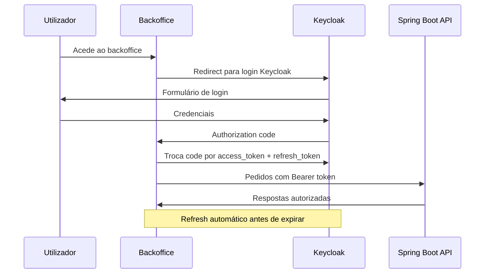
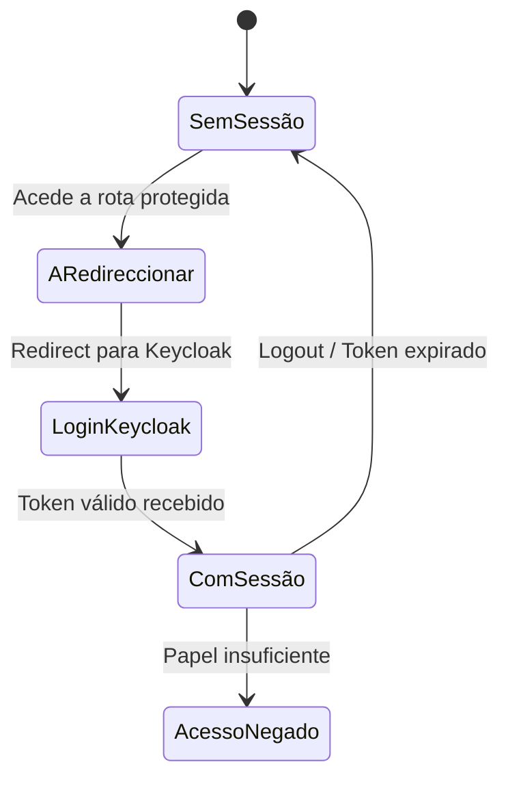
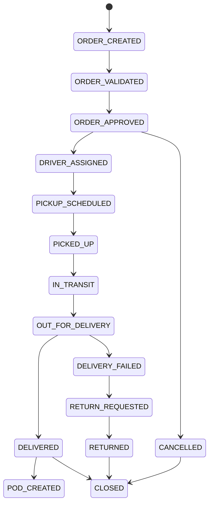
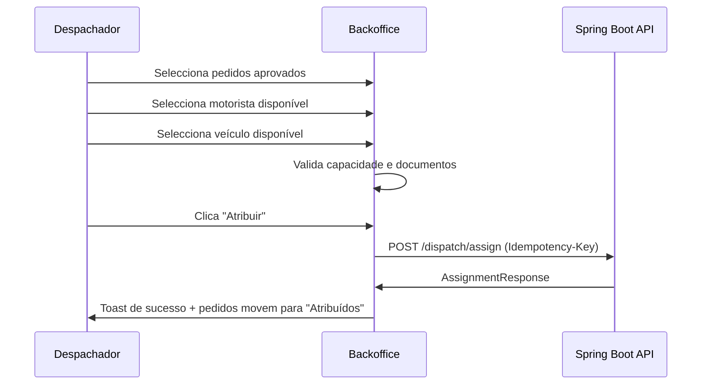
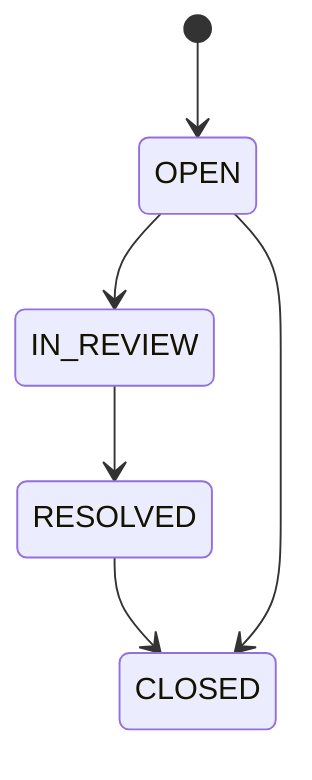

# Logicore Backoffice — Especificação do Frontend Web Operacional

# Logicore Backoffice — Especificação do Frontend Web Operacional

**Versão:** 1.0
**Data:** 2026-05-23
**Relacionado com:** file:specs/001-logistics-management-system/spec.md
**Repositório:** file:backoffice/

## 1. Visão Geral

O **Logicore Backoffice** é o painel web interno do sistema de gestão logística Logicore, utilizado por operadores internos (administradores, gestores de operações, despachadores, suporte, financeiro e auditores) para gerir o ciclo de vida completo de pedidos logísticos em empresas moçambicanas.

O backoffice consome a REST API Spring Boot disponível em `http://localhost:8080/api/v1` e autentica utilizadores via Keycloak OAuth2/OIDC com JWT.

### 1.1 Âmbito desta especificação

Esta especificação cobre **exclusivamente** o frontend de backoffice — o painel web para operadores internos. Não cobre:

- A aplicação móvel do motorista (file:logicore_driver/)
- O portal público de rastreio (file:public-tracking/)
- O backend Spring Boot (file:backend/)

### 1.2 O que está fora de âmbito (fases posteriores)

- Módulo de armazém e inventário
- Facturação e gestão financeira avançada
- Optimização automática de rotas
- Portal de integração com parceiros externos
- Relatórios avançados de BI

## 2. Stack Técnica

| Camada | Tecnologia |
| --- | --- |
| Framework UI | React 19 + Vite |
| Gestão de estado servidor | TanStack Query v5 |
| Gestão de estado cliente | Redux Toolkit |
| Estilos | Tailwind CSS |
| Linguagem | TypeScript |
| Autenticação | Keycloak OAuth2/OIDC (JWT) |
| Backend | Spring Boot 3 REST API — `http://localhost:8080/api/v1` |
| Idioma | Português de Portugal |
| Moeda padrão | MZN / MT |
| Resolução mínima | 1280px (desktop) |

O projecto já tem scaffolding em file:backoffice/ com ecrãs TSX gerados a partir de exportações Stitch. A implementação real deve substituir esses ecrãs estáticos por componentes ligados à API.

## 3. Papéis e Permissões

Os papéis são extraídos do JWT Keycloak e mapeados para `UserRole` no backend.

| Papel | Descrição |
| --- | --- |
| `ADMIN` | Acesso total, incluindo auditoria e configuração |
| `OPERATIONS_MANAGER` | Pedidos, despacho, incidentes, relatórios |
| `DISPATCHER` | Despacho, rastreio, motoristas, frota |
| `SUPPORT` | Pedidos (leitura), incidentes, clientes |
| `FINANCE` | Pedidos (leitura), clientes, relatórios financeiros |
| `AUDITOR` | Auditoria (leitura) e rastreio |

### 3.1 Matriz de acesso por módulo

| Módulo | ADMIN | OPS_MGR | DISPATCHER | SUPPORT | FINANCE | AUDITOR |
| --- | --- | --- | --- | --- | --- | --- |
| Dashboard | ✅ | ✅ | ✅ | ✅ | — | ✅ |
| Pedidos (leitura) | ✅ | ✅ | ✅ | ✅ | ✅ | ✅ |
| Pedidos (mutação) | ✅ | ✅ | ✅ | ✅ | — | — |
| Despacho | ✅ | ✅ | ✅ | — | — | — |
| Rastreio | ✅ | ✅ | ✅ | ✅ | — | ✅ |
| Incidentes (leitura) | ✅ | ✅ | ✅ | ✅ | — | ✅ |
| Incidentes (mutação) | ✅ | ✅ | ✅ | ✅ | — | — |
| Motoristas | ✅ | ✅ | ✅ | — | — | — |
| Frota | ✅ | ✅ | ✅ | — | — | — |
| Clientes | ✅ | ✅ | — | ✅ | ✅ | — |
| Auditoria | ✅ | — | — | — | — | ✅ |

## 4. Arquitectura de Frontend

### 4.1 Estrutura de directórios

```
backoffice/src/
├── api/              # Clientes HTTP por domínio (TanStack Query hooks)
├── components/
│   ├── ui/           # Componentes base (Button, Input, Badge, Modal…)
│   ├── layout/       # AppShell, Sidebar, Header, Breadcrumbs
│   └── shared/       # StatusBadge, ConfirmDialog, EmptyState, Pagination
├── features/
│   ├── auth/         # Login, sessão, guards de rota
│   ├── dashboard/    # KPIs, gráficos
│   ├── orders/       # Lista, detalhe, criar, aprovar, cancelar
│   ├── dispatch/     # Painel de despacho
│   ├── tracking/     # Rastreio por código
│   ├── incidents/    # Lista e detalhe de incidentes
│   ├── drivers/      # Lista e perfil de motoristas
│   ├── fleet/        # Lista e detalhe de veículos
│   ├── customers/    # Lista e perfil de clientes
│   └── audit/        # Registo de auditoria
├── store/            # Redux slices (sessão, UI global)
├── router/           # React Router v6 com guards por papel
└── lib/              # Utilitários (formatação, datas, moeda MZN)
```

### 4.2 Gestão de estado

- **TanStack Query v5** para todo o estado servidor: listas, detalhes, mutações. Configurar `staleTime: 5 * 60 * 1000` no dashboard para refrescamento automático.
- **Redux Toolkit** para estado de sessão (utilizador autenticado, papel, token) e estado de UI global (notificações toast, sidebar collapsed).
- Sem duplicação: dados de API nunca entram no Redux.

### 4.3 Cliente HTTP

Um cliente Axios centralizado em `api/httpClient.ts` que:

- Injeta o header `Authorization: Bearer <token>` em todos os pedidos
- Injeta `Idempotency-Key` (UUID v4 gerado no cliente) nas mutações que o exigem
- Intercepta respostas 401 para desencadear refresh de token via Keycloak
- Intercepta respostas 403 para redirecionar para página de acesso negado

### 4.4 Fluxo de autenticação



## 5. Layout e Navegação

### 5.1 AppShell

O layout principal consiste em:

- **Sidebar fixa** à esquerda (260px) com navegação por módulo
- **Header fixo** no topo com título, pesquisa global, notificações e perfil do utilizador
- **Área de conteúdo** com scroll independente (`ml-[260px] pt-16`)

A sidebar mostra apenas os itens de navegação acessíveis ao papel do utilizador autenticado.

### 5.2 Itens de navegação da sidebar

| Ícone | Rótulo | Rota | Papéis |
| --- | --- | --- | --- |
| `dashboard` | Dashboard | `/` | Todos exceto FINANCE |
| `package_2` | Pedidos | `/orders` | Todos |
| `local_shipping` | Despacho | `/dispatch` | ADMIN, OPS_MGR, DISPATCHER |
| `location_on` | Rastreio | `/tracking` | ADMIN, OPS_MGR, DISPATCHER, SUPPORT, AUDITOR |
| `warning` | Incidentes | `/incidents` | ADMIN, OPS_MGR, DISPATCHER, SUPPORT, AUDITOR |
| `person` | Motoristas | `/drivers` | ADMIN, OPS_MGR, DISPATCHER |
| `directions_bus` | Frota | `/fleet` | ADMIN, OPS_MGR, DISPATCHER |
| `group` | Clientes | `/customers` | ADMIN, OPS_MGR, SUPPORT, FINANCE |
| `history` | Auditoria | `/audit` | ADMIN, AUDITOR |

### 5.3 Wireframe — AppShell

```wireframe

<html>
<head>
<style>
* { box-sizing: border-box; margin: 0; padding: 0; font-family: sans-serif; font-size: 13px; }
body { display: flex; height: 100vh; background: #f5f5f5; }
.sidebar { width: 260px; background: #fff; border-right: 1px solid #e0e0e0; display: flex; flex-direction: column; flex-shrink: 0; }
.sidebar-brand { padding: 20px 24px 16px; border-bottom: 1px solid #e0e0e0; }
.sidebar-brand h1 { font-size: 18px; font-weight: 900; color: #1565C0; }
.sidebar-brand p { font-size: 11px; color: #757575; margin-top: 2px; }
.sidebar-nav { flex: 1; overflow-y: auto; padding: 8px; }
.nav-item { display: flex; align-items: center; gap: 10px; padding: 10px 12px; border-radius: 8px; color: #616161; cursor: pointer; margin-bottom: 2px; }
.nav-item.active { background: #E3F2FD; color: #1565C0; font-weight: 700; border-left: 3px solid #1565C0; }
.nav-item:hover { background: #f5f5f5; }
.nav-icon { width: 18px; height: 18px; background: currentColor; border-radius: 3px; opacity: 0.6; flex-shrink: 0; }
.sidebar-footer { padding: 12px; border-top: 1px solid #e0e0e0; }
.main { flex: 1; display: flex; flex-direction: column; overflow: hidden; }
.header { height: 56px; background: #fff; border-bottom: 1px solid #e0e0e0; display: flex; align-items: center; justify-content: space-between; padding: 0 24px; flex-shrink: 0; }
.header-left { display: flex; align-items: center; gap: 16px; }
.header-title { font-size: 15px; font-weight: 700; color: #1565C0; }
.search-box { border: 1px solid #e0e0e0; border-radius: 20px; padding: 6px 14px; width: 220px; background: #f5f5f5; color: #9e9e9e; }
.header-right { display: flex; align-items: center; gap: 12px; }
.avatar { width: 32px; height: 32px; border-radius: 50%; background: #1565C0; color: #fff; display: flex; align-items: center; justify-content: center; font-weight: 700; font-size: 12px; }
.user-info { text-align: right; }
.user-name { font-weight: 700; font-size: 12px; }
.user-role { font-size: 10px; color: #757575; text-transform: uppercase; }
.content { flex: 1; overflow-y: auto; padding: 24px; }
.breadcrumb { font-size: 12px; color: #757575; margin-bottom: 16px; }
.breadcrumb span { color: #1565C0; }
.page-title { font-size: 20px; font-weight: 700; margin-bottom: 4px; }
.page-sub { font-size: 13px; color: #757575; margin-bottom: 24px; }
.placeholder-content { background: #fff; border: 1px solid #e0e0e0; border-radius: 8px; height: 300px; display: flex; align-items: center; justify-content: center; color: #bdbdbd; font-size: 14px; }
.badge { display: inline-block; padding: 2px 8px; border-radius: 12px; font-size: 10px; font-weight: 700; text-transform: uppercase; }
.badge-blue { background: #E3F2FD; color: #1565C0; }
</style>
</head>
<body>
<div class="sidebar">
  <div class="sidebar-brand">
    <h1>LogiCore</h1>
    <p>Enterprise Logistics</p>
  </div>
  <nav class="sidebar-nav">
    <div class="nav-item active" data-element-id="nav-dashboard">
      <div class="nav-icon"></div>
      <span>Dashboard</span>
    </div>
    <div class="nav-item" data-element-id="nav-orders">
      <div class="nav-icon"></div>
      <span>Pedidos</span>
    </div>
    <div class="nav-item" data-element-id="nav-dispatch">
      <div class="nav-icon"></div>
      <span>Despacho</span>
    </div>
    <div class="nav-item" data-element-id="nav-tracking">
      <div class="nav-icon"></div>
      <span>Rastreio</span>
    </div>
    <div class="nav-item" data-element-id="nav-incidents">
      <div class="nav-icon"></div>
      <span>Incidentes</span>
    </div>
    <div class="nav-item" data-element-id="nav-drivers">
      <div class="nav-icon"></div>
      <span>Motoristas</span>
    </div>
    <div class="nav-item" data-element-id="nav-fleet">
      <div class="nav-icon"></div>
      <span>Frota</span>
    </div>
    <div class="nav-item" data-element-id="nav-customers">
      <div class="nav-icon"></div>
      <span>Clientes</span>
    </div>
    <div class="nav-item" data-element-id="nav-audit">
      <div class="nav-icon"></div>
      <span>Auditoria</span>
    </div>
  </nav>
  <div class="sidebar-footer">
    <div class="nav-item" data-element-id="nav-logout">
      <div class="nav-icon"></div>
      <span>Terminar Sessão</span>
    </div>
  </div>
</div>
<div class="main">
  <header class="header">
    <div class="header-left">
      <span class="header-title">LogiCore Ops</span>
      <input class="search-box" placeholder="Pesquisar pedidos, clientes..." data-element-id="global-search" />
    </div>
    <div class="header-right">
      <span style="color:#757575;cursor:pointer" data-element-id="notifications-btn">🔔</span>
      <div class="user-info">
        <div class="user-name">João Ferreira</div>
        <div class="user-role">Gestor de Operações</div>
      </div>
      <div class="avatar">JF</div>
    </div>
  </header>
  <div class="content">
    <div class="breadcrumb">Início &rsaquo; <span>Dashboard</span></div>
    <div class="page-title">Dashboard Operacional</div>
    <div class="page-sub">Visão geral das operações em tempo real</div>
    <div class="placeholder-content">Conteúdo do módulo activo</div>
  </div>
</div>
</body>
</html>
```

## 6. Módulos Funcionais

### 6.1 Autenticação e Sessão

**Rota:** `/login`
**Endpoint:** Keycloak OIDC (não REST API directamente)

#### Comportamento

- O backoffice usa o fluxo **Authorization Code com PKCE** via Keycloak.
- Ao aceder a qualquer rota protegida sem sessão, o utilizador é redirecionado para o login Keycloak.
- Após autenticação bem-sucedida, o Keycloak redireciona de volta com o token JWT.
- O token é armazenado em memória (Redux) — nunca em `localStorage` por razões de segurança.
- O refresh automático do token ocorre 60 segundos antes da expiração.
- O logout invalida a sessão no Keycloak e limpa o estado Redux.

#### Guards de rota

Cada rota verifica o papel do utilizador. Acesso não autorizado redireciona para `/403`.



### 6.2 Dashboard Operacional

**Rota:** `/`
**Endpoint:** `GET /api/v1/dashboard/summary`
**Papéis:** ADMIN, OPERATIONS_MANAGER, DISPATCHER, SUPPORT, AUDITOR

#### KPIs exibidos

Mapeados directamente do `DashboardSummaryResponse`:

| Campo API | Rótulo UI | Ícone |
| --- | --- | --- |
| `deliveriesToday` | Entregas Hoje | `local_shipping` |
| `failedDeliveries` | Falhas | `cancel` |
| `delayedOrders` | Atrasos | `schedule` |
| `activeDrivers` | Motoristas Activos | `person` |
| `activeVehicles` | Veículos Activos | `directions_bus` |
| `slaAlerts` | Alertas de SLA | `warning` |

- `ordersByStatus` é exibido como distribuição visual (barras ou donut) com os valores de `OrderStatus`.
- Refrescamento automático a cada **5 minutos** via `refetchInterval: 5 * 60 * 1000` no TanStack Query.
- Cada KPI tem indicação de tendência (↑/↓) se o valor diferir do período anterior (fase futura).

#### Wireframe — Dashboard

```wireframe

<html>
<head>
<style>
* { box-sizing: border-box; margin: 0; padding: 0; font-family: sans-serif; font-size: 13px; }
body { background: #f5f5f5; padding: 24px; }
.page-header { display: flex; justify-content: space-between; align-items: flex-end; margin-bottom: 20px; }
.page-title { font-size: 20px; font-weight: 700; }
.page-sub { font-size: 13px; color: #757575; margin-top: 4px; }
.btn { padding: 8px 16px; border-radius: 6px; border: none; cursor: pointer; font-size: 12px; font-weight: 600; }
.btn-primary { background: #1565C0; color: #fff; }
.btn-outline { background: #fff; color: #1565C0; border: 1px solid #1565C0; margin-right: 8px; }
.kpi-grid { display: grid; grid-template-columns: repeat(6, 1fr); gap: 12px; margin-bottom: 20px; }
.kpi-card { background: #fff; border: 1px solid #e0e0e0; border-radius: 8px; padding: 16px; }
.kpi-label { font-size: 11px; color: #757575; text-transform: uppercase; letter-spacing: 0.5px; margin-bottom: 8px; }
.kpi-value { font-size: 24px; font-weight: 700; color: #212121; }
.kpi-value.danger { color: #C62828; }
.kpi-value.warning { color: #E65100; }
.kpi-value.success { color: #2E7D32; }
.kpi-sub { font-size: 11px; color: #9e9e9e; margin-top: 4px; }
.row { display: grid; grid-template-columns: 2fr 1fr; gap: 12px; margin-bottom: 20px; }
.card { background: #fff; border: 1px solid #e0e0e0; border-radius: 8px; padding: 16px; }
.card-title { font-size: 14px; font-weight: 700; margin-bottom: 12px; }
.chart-placeholder { height: 160px; background: #f5f5f5; border-radius: 6px; display: flex; align-items: center; justify-content: center; color: #bdbdbd; }
.status-row { display: flex; justify-content: space-between; align-items: center; padding: 6px 0; border-bottom: 1px solid #f5f5f5; }
.status-label { display: flex; align-items: center; gap: 8px; }
.dot { width: 8px; height: 8px; border-radius: 50%; }
.dot-blue { background: #1565C0; }
.dot-green { background: #2E7D32; }
.dot-orange { background: #E65100; }
.dot-red { background: #C62828; }
.dot-grey { background: #9e9e9e; }
.status-count { font-weight: 700; }
.table { width: 100%; border-collapse: collapse; }
.table th { text-align: left; font-size: 11px; text-transform: uppercase; color: #757575; padding: 8px 12px; border-bottom: 2px solid #e0e0e0; }
.table td { padding: 10px 12px; border-bottom: 1px solid #f5f5f5; }
.badge { display: inline-block; padding: 2px 8px; border-radius: 12px; font-size: 10px; font-weight: 700; text-transform: uppercase; }
.badge-orange { background: #FFF3E0; color: #E65100; }
.badge-red { background: #FFEBEE; color: #C62828; }
.badge-blue { background: #E3F2FD; color: #1565C0; }
.refresh-note { font-size: 11px; color: #9e9e9e; text-align: right; margin-bottom: 8px; }
</style>
</head>
<body>
<div class="page-header">
  <div>
    <div class="page-title">Dashboard Operacional</div>
    <div class="page-sub">Visão geral · Actualizado às 14:32 · Próxima actualização em 5 min</div>
  </div>
  <div>
    <button class="btn btn-outline" data-element-id="export-btn">Exportar PDF</button>
    <button class="btn btn-primary" data-element-id="new-order-btn">+ Novo Pedido</button>
  </div>
</div>

<div class="kpi-grid">
  <div class="kpi-card">
    <div class="kpi-label">Entregas Hoje</div>
    <div class="kpi-value">142</div>
    <div class="kpi-sub">+12 vs ontem</div>
  </div>
  <div class="kpi-card">
    <div class="kpi-label">Falhas</div>
    <div class="kpi-value danger">8</div>
    <div class="kpi-sub">5.6% taxa de falha</div>
  </div>
  <div class="kpi-card">
    <div class="kpi-label">Atrasos</div>
    <div class="kpi-value warning">23</div>
    <div class="kpi-sub">Risco de SLA</div>
  </div>
  <div class="kpi-card">
    <div class="kpi-label">Motoristas Activos</div>
    <div class="kpi-value success">34</div>
    <div class="kpi-sub">de 40 disponíveis</div>
  </div>
  <div class="kpi-card">
    <div class="kpi-label">Veículos Activos</div>
    <div class="kpi-value">28</div>
    <div class="kpi-sub">de 35 frota</div>
  </div>
  <div class="kpi-card">
    <div class="kpi-label">Alertas SLA</div>
    <div class="kpi-value danger">5</div>
    <div class="kpi-sub">Acção necessária</div>
  </div>
</div>

<div class="row">
  <div class="card">
    <div class="card-title">Volume de Entregas — Hoje</div>
    <div class="chart-placeholder">[ Gráfico de linha — entregas por hora ]</div>
  </div>
  <div class="card">
    <div class="card-title">Estado dos Pedidos</div>
    <div class="status-row"><div class="status-label"><div class="dot dot-blue"></div>Em Trânsito</div><div class="status-count">47</div></div>
    <div class="status-row"><div class="status-label"><div class="dot dot-green"></div>Entregues</div><div class="status-count">89</div></div>
    <div class="status-row"><div class="status-label"><div class="dot dot-orange"></div>Aprovados</div><div class="status-count">31</div></div>
    <div class="status-row"><div class="status-label"><div class="dot dot-red"></div>Falha Entrega</div><div class="status-count">8</div></div>
    <div class="status-row"><div class="status-label"><div class="dot dot-grey"></div>Outros</div><div class="status-count">12</div></div>
  </div>
</div>

<div class="card">
  <div class="card-title">Pedidos Urgentes / Risco de SLA</div>
  <table class="table">
    <thead>
      <tr>
        <th>Tracking</th>
        <th>Cliente</th>
        <th>Valor Est.</th>
        <th>SLA</th>
        <th>Estado</th>
        <th>Acções</th>
      </tr>
    </thead>
    <tbody>
      <tr>
        <td><strong>LC-992384-PT</strong></td>
        <td>Empresa ABC Lda</td>
        <td>12.500 MT</td>
        <td style="color:#C62828">Expirado há 2h</td>
        <td><span class="badge badge-orange">Em Trânsito</span></td>
        <td><a href="#" style="color:#1565C0;font-size:12px" data-element-id="order-detail-link">Ver Detalhe</a></td>
      </tr>
      <tr>
        <td><strong>LC-992401-PT</strong></td>
        <td>João Silva</td>
        <td>3.200 MT</td>
        <td style="color:#E65100">Expira em 45 min</td>
        <td><span class="badge badge-blue">Aprovado</span></td>
        <td><a href="#" style="color:#1565C0;font-size:12px" data-element-id="dispatch-link">Despachar</a></td>
      </tr>
    </tbody>
  </table>
</div>
</body>
</html>
```

### 6.3 Gestão de Pedidos Logísticos

**Rotas:** `/orders`, `/orders/new`, `/orders/:id`
**Endpoints:**

- `GET /api/v1/orders` — lista paginada com filtros
- `POST /api/v1/orders` — criar pedido (com `Idempotency-Key`)
- `GET /api/v1/orders/:id` — detalhe
- `PATCH /api/v1/orders/:id/approve` — aprovar (com `Idempotency-Key`)
- `PATCH /api/v1/orders/:id/cancel` — cancelar (com `Idempotency-Key`)
- `PATCH /api/v1/orders/:id/reschedule` — reagendar (com `Idempotency-Key`)
- `GET /api/v1/internal/tracking?trackingCode=` — timeline de eventos

#### 6.3.1 Lista de Pedidos (`/orders`)

**Filtros disponíveis:**

- `status` — dropdown com valores de `OrderStatus`
- `customerId` — pesquisa de cliente
- `trackingCode` — campo de texto livre
- Intervalo de datas (campo `scheduledPickupAt`)

**Colunas da tabela:**

| Coluna | Campo API |
| --- | --- |
| Código de Rastreio | `trackingCode` |
| Estado | `status` (com badge colorido) |
| Cliente | `customerId` (resolvido via cache) |
| Valor Estimado | `estimatedPriceAmount` + `estimatedPriceCurrency` |
| SLA | `slaDueAt` (com alerta visual se expirado) |
| Acções | Aprovar / Cancelar / Ver Detalhe |

- Paginação: parâmetros `page` e `size` (padrão 20). Suporte a 1000+ registos.
- Ordenação por `slaDueAt` ascendente por defeito.

**Estados de ****`OrderStatus`**** e cores:**

| Status | Cor | Rótulo PT |
| --- | --- | --- |
| `DRAFT` | Cinzento | Rascunho |
| `CREATED` | Azul claro | Criado |
| `VALIDATED` | Azul | Validado |
| `APPROVED` | Verde claro | Aprovado |
| `ASSIGNED` | Verde | Atribuído |
| `PICKUP_SCHEDULED` | Azul | Recolha Agendada |
| `PICKED_UP` | Azul escuro | Recolhido |
| `IN_TRANSIT` | Laranja | Em Trânsito |
| `OUT_FOR_DELIVERY` | Âmbar | Em Entrega |
| `FAILED_DELIVERY` | Vermelho | Falha de Entrega |
| `DELIVERED` | Verde escuro | Entregue |
| `RETURN_REQUESTED` | Roxo | Devolução Solicitada |
| `RETURNED` | Roxo escuro | Devolvido |
| `CANCELLED` | Vermelho escuro | Cancelado |
| `CLOSED` | Cinzento escuro | Fechado |

#### 6.3.2 Criar Pedido (`/orders/new`)

Formulário multi-passo ou de página única com os campos de `CreateOrderRequest`:

| Campo | Tipo | Obrigatório |
| --- | --- | --- |
| Cliente | Pesquisa/select de cliente | ✅ |
| Tipo de Serviço | Select (`ServiceType`) | ✅ |
| Prioridade | Select (`Priority`) | — |
| Data/hora de recolha | DateTimePicker | — |
| Data/hora de entrega | DateTimePicker | — |
| Endereço de origem | Campos de endereço | ✅ |
| Endereço de destino | Campos de endereço | ✅ |
| Pacotes | Lista dinâmica (peso, volume, descrição) | ✅ (mín. 1) |

- O botão de submissão gera um `Idempotency-Key` (UUID v4) antes de enviar.
- Após criação bem-sucedida, redireciona para o detalhe do pedido.

**Valores de ****`ServiceType`****:** PICKUP, DELIVERY, TRANSPORT, RETURN, STANDARD, EXPRESS, SAME_DAY, SCHEDULED
**Valores de ****`Priority`****:** LOW, NORMAL, HIGH, CRITICAL, URGENT

#### 6.3.3 Detalhe do Pedido (`/orders/:id`)

- Informação completa do pedido (todos os campos de `OrderResponse`)
- **Timeline de eventos** carregada de `GET /api/v1/internal/tracking?trackingCode=<code>` com todos os `TrackingEventType`
- **Acções disponíveis** conforme o estado actual e o papel do utilizador:
  - `CREATED`/`VALIDATED` → botão **Aprovar** (com confirmação)
  - Qualquer estado activo → botão **Cancelar** (com modal de motivo obrigatório)
  - `APPROVED`/`ASSIGNED` → botão **Reagendar** (com modal de nova data)
- **Comprovativo de entrega (POD):** link para `GET /api/v1/orders/:id/proof-of-delivery` quando o estado é `DELIVERED`

**Timeline de ****`TrackingEventType`****:**



#### Wireframe — Detalhe do Pedido

```wireframe

<html>
<head>
<style>
* { box-sizing: border-box; margin: 0; padding: 0; font-family: sans-serif; font-size: 13px; }
body { background: #f5f5f5; padding: 24px; }
.breadcrumb { font-size: 12px; color: #757575; margin-bottom: 16px; }
.breadcrumb a { color: #1565C0; text-decoration: none; }
.page-header { display: flex; justify-content: space-between; align-items: flex-start; margin-bottom: 20px; }
.page-title { font-size: 20px; font-weight: 700; }
.tracking-code { font-size: 13px; color: #757575; margin-top: 4px; font-family: monospace; }
.actions { display: flex; gap: 8px; }
.btn { padding: 8px 16px; border-radius: 6px; border: none; cursor: pointer; font-size: 12px; font-weight: 600; }
.btn-primary { background: #1565C0; color: #fff; }
.btn-success { background: #2E7D32; color: #fff; }
.btn-danger { background: #C62828; color: #fff; }
.btn-outline { background: #fff; color: #616161; border: 1px solid #e0e0e0; }
.grid { display: grid; grid-template-columns: 2fr 1fr; gap: 16px; }
.card { background: #fff; border: 1px solid #e0e0e0; border-radius: 8px; padding: 16px; margin-bottom: 16px; }
.card-title { font-size: 14px; font-weight: 700; margin-bottom: 12px; padding-bottom: 8px; border-bottom: 1px solid #f5f5f5; }
.info-grid { display: grid; grid-template-columns: 1fr 1fr; gap: 12px; }
.info-item label { font-size: 11px; color: #757575; text-transform: uppercase; display: block; margin-bottom: 4px; }
.info-item value { font-weight: 600; }
.badge { display: inline-block; padding: 3px 10px; border-radius: 12px; font-size: 11px; font-weight: 700; text-transform: uppercase; }
.badge-orange { background: #FFF3E0; color: #E65100; }
.timeline { position: relative; padding-left: 24px; }
.timeline-item { position: relative; padding-bottom: 16px; }
.timeline-item::before { content: ''; position: absolute; left: -20px; top: 4px; width: 8px; height: 8px; border-radius: 50%; background: #1565C0; }
.timeline-item::after { content: ''; position: absolute; left: -17px; top: 12px; width: 2px; height: calc(100% - 8px); background: #e0e0e0; }
.timeline-item:last-child::after { display: none; }
.timeline-event { font-weight: 600; font-size: 12px; }
.timeline-time { font-size: 11px; color: #9e9e9e; margin-top: 2px; }
.timeline-desc { font-size: 12px; color: #616161; margin-top: 2px; }
.package-row { display: flex; justify-content: space-between; padding: 8px 0; border-bottom: 1px solid #f5f5f5; }
</style>
</head>
<body>
<div class="breadcrumb"><a href="#">Pedidos</a> › LC-992384-PT</div>
<div class="page-header">
  <div>
    <div class="page-title">Pedido LC-992384-PT</div>
    <div class="tracking-code">ID: 3fa85f64-5717-4562-b3fc-2c963f66afa6</div>
    <div style="margin-top:8px"><span class="badge badge-orange">Em Trânsito</span></div>
  </div>
  <div class="actions">
    <button class="btn btn-outline" data-element-id="reschedule-btn">Reagendar</button>
    <button class="btn btn-danger" data-element-id="cancel-btn">Cancelar</button>
    <button class="btn btn-success" data-element-id="approve-btn">Aprovar</button>
  </div>
</div>

<div class="grid">
  <div>
    <div class="card">
      <div class="card-title">Informação do Pedido</div>
      <div class="info-grid">
        <div class="info-item"><label>Cliente</label><div>Empresa ABC Lda</div></div>
        <div class="info-item"><label>Tipo de Serviço</label><div>EXPRESS</div></div>
        <div class="info-item"><label>Prioridade</label><div>HIGH</div></div>
        <div class="info-item"><label>Valor Estimado</label><div>12.500 MT</div></div>
        <div class="info-item"><label>SLA</label><div style="color:#C62828">23 Mai 2026 14:00 (expirado)</div></div>
        <div class="info-item"><label>Recolha Agendada</label><div>23 Mai 2026 09:00</div></div>
      </div>
    </div>
    <div class="card">
      <div class="card-title">Endereços</div>
      <div class="info-grid">
        <div class="info-item"><label>Origem</label><div>Av. 25 de Setembro, 1200<br>Maputo, Moçambique</div></div>
        <div class="info-item"><label>Destino</label><div>Rua da Beira, 45<br>Beira, Moçambique</div></div>
      </div>
    </div>
    <div class="card">
      <div class="card-title">Pacotes</div>
      <div class="package-row"><span>Caixa 1 — Electrónica</span><span>25 kg · 0.3 m³</span></div>
      <div class="package-row"><span>Caixa 2 — Documentos</span><span>2 kg · 0.05 m³</span></div>
    </div>
  </div>
  <div>
    <div class="card">
      <div class="card-title">Timeline de Eventos</div>
      <div class="timeline">
        <div class="timeline-item">
          <div class="timeline-event">Pedido Criado</div>
          <div class="timeline-time">23 Mai 2026 · 08:15</div>
        </div>
        <div class="timeline-item">
          <div class="timeline-event">Pedido Validado</div>
          <div class="timeline-time">23 Mai 2026 · 08:16</div>
        </div>
        <div class="timeline-item">
          <div class="timeline-event">Pedido Aprovado</div>
          <div class="timeline-time">23 Mai 2026 · 08:45</div>
          <div class="timeline-desc">Por: João Ferreira (OPERATIONS_MANAGER)</div>
        </div>
        <div class="timeline-item">
          <div class="timeline-event">Motorista Atribuído</div>
          <div class="timeline-time">23 Mai 2026 · 09:00</div>
          <div class="timeline-desc">Ricardo Mendes · Viatura AA-22-ZZ</div>
        </div>
        <div class="timeline-item">
          <div class="timeline-event">Recolhido</div>
          <div class="timeline-time">23 Mai 2026 · 09:30</div>
        </div>
        <div class="timeline-item" style="opacity:0.5">
          <div class="timeline-event">Em Trânsito</div>
          <div class="timeline-time">23 Mai 2026 · 10:05</div>
        </div>
      </div>
    </div>
  </div>
</div>
</body>
</html>
```

### 6.4 Painel de Despacho

**Rota:** `/dispatch`
**Endpoints:**

- `GET /api/v1/orders?status=APPROVED` — pedidos prontos para despacho
- `GET /api/v1/drivers?status=AVAILABLE` — motoristas disponíveis
- `GET /api/v1/vehicles?status=AVAILABLE` — veículos disponíveis
- `GET /api/v1/drivers/:id/tasks` — tarefas activas do motorista seleccionado
- `POST /api/v1/dispatch/assign` — atribuir pedidos (com `Idempotency-Key`)

**Papéis:** ADMIN, OPERATIONS_MANAGER, DISPATCHER

#### Layout do painel de despacho

O painel usa um layout de 3 colunas:

1. **Coluna esquerda** — Lista de pedidos aprovados, agrupados por prioridade (`Priority`) e ordenados por `slaDueAt` ascendente. Cada card mostra: tracking code, origem → destino, peso total, tipo de serviço, SLA restante.
2. **Coluna central** — Área de selecção e confirmação de atribuição. O operador selecciona pedidos (checkbox) e escolhe motorista + veículo. Mostra validações em tempo real.
3. **Coluna direita** — Lista de motoristas e veículos disponíveis. Ao seleccionar um motorista, mostra as suas tarefas activas (`GET /api/v1/drivers/:id/tasks`).

#### Validações em tempo real (antes de submeter)

| Validação | Condição de erro |
| --- | --- |
| Capacidade do veículo | Peso total dos pedidos > `capacityWeightKg` do veículo |
| Disponibilidade do motorista | `DriverStatus` ≠ `AVAILABLE` |
| Disponibilidade do veículo | `VehicleStatus` ≠ `AVAILABLE` |
| Documentos do motorista | `licenseValidUntil` ou `documentsValidUntil` < hoje |
| Documentos do veículo | `documentsValidUntil` ou `inspectionValidUntil` < hoje |
| Tipo de serviço | Verificação de compatibilidade (se aplicável) |

#### Fluxo de atribuição



- O `AssignOrdersRequest` inclui: `orderIds[]`, `driverId`, `vehicleId`, `plannedStartAt`, `stopSequence[]`.
- Após atribuição bem-sucedida, os pedidos desaparecem da lista de pendentes e o motorista passa a `ASSIGNED`.

### 6.5 Rastreio em Tempo Real

**Rota:** `/tracking`
**Endpoint:** `GET /api/v1/internal/tracking?trackingCode=<code>`
**Papéis:** ADMIN, OPERATIONS_MANAGER, DISPATCHER, SUPPORT, AUDITOR

- Campo de pesquisa por código de rastreio (formato `LC-XXXXXX-PT`)
- Ao pesquisar, carrega a lista de `InternalTrackingEventResponse` para o código
- Exibe timeline completa com: `eventType`, `description`, `occurredAt`, `publicVisible`, `customerVisible`
- Eventos marcados como `publicVisible: false` são exibidos com indicação visual de "interno"
- Sem paginação (lista completa de eventos por pedido)

### 6.6 Gestão de Incidentes

**Rota:** `/incidents`, `/incidents/:id`
**Endpoints:**

- `GET /api/v1/incidents` — lista paginada com filtro por `status`
- `GET /api/v1/incidents/:id` — detalhe
- `PATCH /api/v1/incidents/:id/status` — actualizar estado
- `POST /api/v1/incidents` — criar incidente

**Papéis leitura:** ADMIN, OPERATIONS_MANAGER, DISPATCHER, SUPPORT, AUDITOR
**Papéis mutação:** ADMIN, OPERATIONS_MANAGER, DISPATCHER, SUPPORT

#### Estados e transições de `IncidentStatus`



<user_quoted_section>Nota: O backend usa IN_REVIEW (não IN_PROGRESS como mencionado no briefing). O frontend deve usar o valor exacto do enum.</user_quoted_section>

#### Severidades e cores visuais

| Severidade | Cor | Badge |
| --- | --- | --- |
| `LOW` | Cinzento | Baixa |
| `MEDIUM` | Âmbar | Média |
| `HIGH` | Laranja | Alta |
| `CRITICAL` | Vermelho | Crítica |

#### Campos do detalhe de incidente (`IncidentResponse`)

- `id`, `status`, `category`, `severity`
- `orderId` — link para o pedido associado
- `taskId` — link para a tarefa associada
- `description`

### 6.7 Gestão de Motoristas

**Rota:** `/drivers`, `/drivers/new`, `/drivers/:id`
**Endpoints:**

- `GET /api/v1/drivers` — lista com filtro por `status`
- `GET /api/v1/drivers/:id` — perfil completo
- `POST /api/v1/drivers` — criar motorista
- `PUT /api/v1/drivers/:id` — editar motorista
- `GET /api/v1/drivers/:id/tasks` — tarefas activas

**Papéis:** ADMIN, OPERATIONS_MANAGER, DISPATCHER

#### Campos de `DriverResponse`

| Campo | Descrição |
| --- | --- |
| `id` | UUID |
| `userId` | UUID do utilizador Keycloak associado |
| `name` | Nome completo |
| `phone` | Contacto telefónico |
| `status` | `DriverStatus` |
| `licenseNumber` | Número da carta de condução |
| `licenseValidUntil` | Data de validade da carta |
| `documentsValidUntil` | Data de validade dos documentos |
| `currentShiftStatus` | Estado do turno actual |

#### Estados de `DriverStatus`

| Status | Cor | Rótulo PT |
| --- | --- | --- |
| `AVAILABLE` | Verde | Disponível |
| `ASSIGNED` | Azul | Atribuído |
| `ON_ROUTE` | Laranja | Em Rota |
| `ON_BREAK` | Âmbar | Em Pausa |
| `OFFLINE` | Cinzento | Offline |
| `BLOCKED` | Vermelho | Bloqueado |

#### Alertas de documentos

- Se `licenseValidUntil` ou `documentsValidUntil` estiver nos próximos **30 dias**, exibir badge de aviso amarelo na lista e no perfil.
- Se já expirado, exibir badge vermelho e impedir atribuição no painel de despacho.

### 6.8 Gestão da Frota de Veículos

**Rota:** `/fleet`, `/fleet/new`, `/fleet/:id`
**Endpoints:**

- `GET /api/v1/vehicles` — lista com filtro por `status`
- `GET /api/v1/vehicles/:id` — detalhe
- `POST /api/v1/vehicles` — criar veículo
- `PUT /api/v1/vehicles/:id` — editar veículo

**Papéis:** ADMIN, OPERATIONS_MANAGER, DISPATCHER

#### Campos de `VehicleResponse`

| Campo | Descrição |
| --- | --- |
| `id` | UUID |
| `type` | Tipo de veículo (ex: "Camião", "Furgão") |
| `licensePlate` | Matrícula |
| `status` | `VehicleStatus` |
| `capacityWeightKg` | Capacidade em kg |
| `capacityVolumeM3` | Capacidade em m³ |
| `documentsValidUntil` | Validade dos documentos |
| `inspectionValidUntil` | Validade da inspecção |

#### Estados de `VehicleStatus`

| Status | Cor | Rótulo PT |
| --- | --- | --- |
| `AVAILABLE` | Verde | Disponível |
| `ASSIGNED` | Azul | Atribuído |
| `IN_ROUTE` | Laranja | Em Rota |
| `MAINTENANCE` | Âmbar | Em Manutenção |
| `BLOCKED` | Vermelho | Bloqueado |
| `INACTIVE` | Cinzento | Inactivo |

#### Alertas de documentos e inspecção

- Mesma lógica dos motoristas: aviso a 30 dias, erro se expirado.

### 6.9 Gestão de Clientes

**Rota:** `/customers`, `/customers/new`, `/customers/:id`
**Endpoints:**

- `GET /api/v1/customers` — lista com filtro por `status`
- `GET /api/v1/customers/:id` — perfil
- `POST /api/v1/customers` — criar cliente
- `PUT /api/v1/customers/:id` — editar cliente
- `GET /api/v1/orders?customerId=:id` — pedidos do cliente

**Papéis:** ADMIN, OPERATIONS_MANAGER, SUPPORT, FINANCE

#### Campos de `CustomerResponse`

| Campo | Descrição |
| --- | --- |
| `id` | UUID |
| `name` | Nome / Razão social |
| `type` | `CustomerType`: INDIVIDUAL ou COMPANY |
| `status` | `RecordStatus`: ACTIVE, SUSPENDED, BLOCKED, INACTIVE |
| `taxNumber` | NUIT (número de identificação fiscal) |
| `email` | Email de contacto |
| `phone` | Telefone |

<user_quoted_section>Nota: O RecordStatus do backend tem os valores ACTIVE, SUSPENDED, BLOCKED, INACTIVE — não ARCHIVED como mencionado no briefing. O frontend deve usar os valores exactos do enum.</user_quoted_section>

#### Perfil do cliente

- Dados pessoais/empresariais
- Lista de pedidos associados (via `GET /api/v1/orders?customerId=:id`)
- Histórico de actividade

### 6.10 Registo de Auditoria

**Rota:** `/audit`
**Endpoint:** `GET /api/v1/audit-logs?page=0&size=20`
**Papéis:** ADMIN, AUDITOR (exclusivo)

#### Campos de `AuditLogResponse`

| Campo | Rótulo UI |
| --- | --- |
| `actorUserId` | Utilizador |
| `actorRole` | Papel |
| `action` | Acção |
| `entityType` | Entidade |
| `entityId` | ID da Entidade |
| `correlationId` | Correlação |
| `occurredAt` | Data/Hora |

- Lista **read-only** — sem acções de mutação.
- Paginação com `page` e `size` (máximo 100 por página, conforme backend).
- Sem filtros adicionais nesta fase (o backend não expõe filtros por actor ou acção ainda).

## 7. Componentes Partilhados

### 7.1 StatusBadge

Componente reutilizável que recebe `status` e `type` (order | driver | vehicle | incident | customer) e renderiza o badge com a cor e rótulo correctos em português.

### 7.2 ConfirmDialog

Modal de confirmação para acções destrutivas (cancelar pedido, bloquear motorista). Aceita `title`, `message`, `onConfirm`, `onCancel`. Para cancelamentos, inclui campo de texto obrigatório para o motivo.

### 7.3 Paginação

Componente de paginação que recebe `PageResponse<T>` do backend (`page`, `size`, `totalElements`, `totalPages`) e renderiza controlos de navegação.

### 7.4 Toast / Notificações

Sistema de notificações globais via Redux slice. Tipos: `success`, `error`, `warning`, `info`. Auto-dismiss após 5 segundos. Posição: canto superior direito.

### 7.5 DocumentExpiryAlert

Componente de alerta para documentos a expirar. Exibe badge amarelo (< 30 dias) ou vermelho (expirado) com a data de validade.

## 8. Contratos de API Relevantes

### 8.1 Paginação

O backend retorna `PageResponse<T>`:

```
{ content: T[], page: number, size: number, totalElements: number, totalPages: number }
```

### 8.2 Idempotência

As seguintes operações **exigem** o header `Idempotency-Key` (UUID v4):

| Operação | Endpoint |
| --- | --- |
| Criar pedido | `POST /api/v1/orders` |
| Actualizar pedido | `PUT /api/v1/orders/:id` |
| Aprovar pedido | `PATCH /api/v1/orders/:id/approve` |
| Cancelar pedido | `PATCH /api/v1/orders/:id/cancel` |
| Reagendar pedido | `PATCH /api/v1/orders/:id/reschedule` |
| Atribuir despacho | `POST /api/v1/dispatch/assign` |

O cliente HTTP deve gerar um novo UUID v4 por operação de mutação iniciada pelo utilizador.

### 8.3 Erros da API

O backend retorna `ApiError` com `status`, `message`, `timestamp`. O frontend deve exibir `message` no toast de erro.

## 9. Requisitos Não-Funcionais

| Requisito | Critério |
| --- | --- |
| Performance de lista | Tempo de carregamento < 1s em condições normais |
| Feedback de mutação | Loading state imediato, toast de sucesso/erro após resposta |
| Paginação | Suporte a listas com 1000+ registos via paginação server-side |
| Idempotência | `Idempotency-Key` em todas as mutações que o exigem |
| Idioma | Português de Portugal em toda a UI |
| Resolução | Desktop mínimo 1280px; não é necessário suporte mobile |
| Acessibilidade | Contraste WCAG AA nos badges de estado |
| Segurança | Token JWT nunca em `localStorage`; refresh automático |

## 10. Rotas e Guards

| Rota | Componente | Papéis permitidos |
| --- | --- | --- |
| `/login` | `LoginPage` | Público |
| `/` | `DashboardPage` | Todos exceto FINANCE |
| `/orders` | `OrdersListPage` | Todos |
| `/orders/new` | `CreateOrderPage` | ADMIN, OPS_MGR, DISPATCHER, SUPPORT |
| `/orders/:id` | `OrderDetailPage` | Todos |
| `/dispatch` | `DispatchPage` | ADMIN, OPS_MGR, DISPATCHER |
| `/tracking` | `TrackingPage` | ADMIN, OPS_MGR, DISPATCHER, SUPPORT, AUDITOR |
| `/incidents` | `IncidentsListPage` | ADMIN, OPS_MGR, DISPATCHER, SUPPORT, AUDITOR |
| `/incidents/:id` | `IncidentDetailPage` | ADMIN, OPS_MGR, DISPATCHER, SUPPORT, AUDITOR |
| `/drivers` | `DriversListPage` | ADMIN, OPS_MGR, DISPATCHER |
| `/drivers/new` | `CreateDriverPage` | ADMIN, OPS_MGR |
| `/drivers/:id` | `DriverDetailPage` | ADMIN, OPS_MGR, DISPATCHER |
| `/fleet` | `FleetListPage` | ADMIN, OPS_MGR, DISPATCHER |
| `/fleet/new` | `CreateVehiclePage` | ADMIN, OPS_MGR |
| `/fleet/:id` | `VehicleDetailPage` | ADMIN, OPS_MGR, DISPATCHER |
| `/customers` | `CustomersListPage` | ADMIN, OPS_MGR, SUPPORT, FINANCE |
| `/customers/new` | `CreateCustomerPage` | ADMIN, OPS_MGR, SUPPORT |
| `/customers/:id` | `CustomerDetailPage` | ADMIN, OPS_MGR, SUPPORT, FINANCE |
| `/audit` | `AuditLogPage` | ADMIN, AUDITOR |
| `/403` | `AccessDeniedPage` | Público |

## 11. Critérios de Aceitação

| ID | Critério |
| --- | --- |
| CA-001 | O utilizador consegue autenticar-se via Keycloak e aceder ao dashboard |
| CA-002 | O dashboard exibe os 6 KPIs correctos com refrescamento automático a cada 5 minutos |
| CA-003 | A lista de pedidos filtra correctamente por status, cliente e código de rastreio |
| CA-004 | Um pedido pode ser criado, aprovado e cancelado com feedback visual em cada passo |
| CA-005 | O painel de despacho valida capacidade e documentos antes de permitir atribuição |
| CA-006 | A atribuição de despacho usa `Idempotency-Key` e é idempotente |
| CA-007 | A timeline de rastreio exibe todos os eventos internos de um pedido |
| CA-008 | O estado de um incidente pode ser actualizado de OPEN → IN_REVIEW → RESOLVED → CLOSED |
| CA-009 | Motoristas e veículos com documentos a expirar em < 30 dias exibem alerta visual |
| CA-010 | O registo de auditoria é acessível apenas a ADMIN e AUDITOR |
| CA-011 | Rotas protegidas redirecionam para `/403` quando o papel é insuficiente |
| CA-012 | Todas as notificações de sucesso/erro são exibidas como toast |
| CA-013 | A paginação funciona correctamente para listas com 1000+ registos |
| CA-014 | O logout invalida a sessão e redireciona para o login Keycloak |